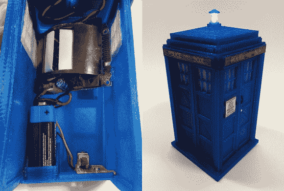

# TARDIS 警报不响 VWORRRRRP VWRORRRP VWORRRP

> 原文：<https://hackaday.com/2014/02/11/tardis-alarm-doesnt-go-vworrrrrp-vwrorrrp-vworrrp/>

运动传感器非常有用——但它们实在太丑了！嗯——如果你是一个 Whovian 人——也许这个黑客适合你。一个 [3D 打印的 TARDIS 运动传感器报警](http://www.3dhacker.com/category/599/Action-Figures/listings/569/Tardis-Motion-Sensor-Alarm.html)！

[马尔科姆]有一个家庭安全系统，使用一系列的运动传感器来检测房子里的运动。当检测到移动时，LED 指示灯会亮起，并向主控制系统发送无线信号。因此，在 Thingiverse 上发现了一个不错的 3D 模型“TARDIS”T1(**T**ime**a**nd**R**R**相对尺寸**D**I**n**S**pace)之后，他决定试试能否将他的一个运动传感器植入其中。

事实证明，这很简单，只需移除传感器的外壳，在 TARDIS 内部 3D 打印几个支撑件，并焊接一个亮蓝色的 LED 以取代极小的指示灯。简单，但是有效！

别忘了看看下面的视频。艾伦-y！

[https://www.youtube.com/embed/aJMGgtxQixc?version=3&rel=1&showsearch=0&showinfo=1&iv_load_policy=1&fs=1&hl=en-US&autohide=2&wmode=transparent](https://www.youtube.com/embed/aJMGgtxQixc?version=3&rel=1&showsearch=0&showinfo=1&iv_load_policy=1&fs=1&hl=en-US&autohide=2&wmode=transparent)

可悲的是，它不走 [vworrrrp。有趣的事实是，TARDIS 发出的呻吟和喘息声最初是通过拖动竖式钢琴的低音弦来实现的。有一点后期处理，但显然](http://www.youtube.com/watch?v=nIXpgqduqeY)[它的精髓今天仍在使用！](http://drwho.answers.wikia.com/wiki/What_Sound_does_the_TARDIS_make_when_lifting_off)