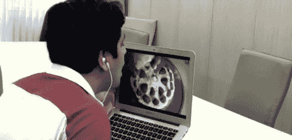

# 味觉视觉现在是一种东西

> 原文：<https://hackaday.com/2014/02/27/taste-o-vision-is-now-a-thing/>

不满足于 20 世纪 50 年代后期的嗅觉视觉概念[尼美沙]已经创造了一些非凡的东西:[一个数字味觉传感器](http://nimesha.info/digitaltaste.html#dti)，能够用一点点热、电和一个 Arduino 来代表味觉

据称，该设备通过使用银电极对舌头进行热和电刺激来工作。根据[这个视频](http://www.youtube.com/watch?v=PBpd3aEl0bg)，不同的电流和温度造就了不同的味道。例如，通过将电流从 60uA 改变到 180uA 并将温度升高到 30 摄氏度，在电极上产生酸味。通过简单地将温度从 22C 降低到 19C 来生产薄荷。

控制电子设备包括 Arduino、电机控制器和连接到一个银电极的散热器。通信是通过 USB 完成的，当然还有*[有一个手机应用程序为它服务](http://nimesha.info/tasteip.html)，更具体地说是一个叫做 IP 上的味道的协议。这使得任何人都可以用这些设备向任何人发送味道。*

 *下面的视频，在你笑之前，我们真的很想尝试其中的一个。

谢谢[杰斯]的提示。

[https://www.youtube.com/embed/7HMDIIWgAhc?version=3&rel=1&showsearch=0&showinfo=1&iv_load_policy=1&fs=1&hl=en-US&autohide=2&wmode=transparent](https://www.youtube.com/embed/7HMDIIWgAhc?version=3&rel=1&showsearch=0&showinfo=1&iv_load_policy=1&fs=1&hl=en-US&autohide=2&wmode=transparent)

[https://www.youtube.com/embed/PBpd3aEl0bg?version=3&rel=1&showsearch=0&showinfo=1&iv_load_policy=1&fs=1&hl=en-US&autohide=2&wmode=transparent](https://www.youtube.com/embed/PBpd3aEl0bg?version=3&rel=1&showsearch=0&showinfo=1&iv_load_policy=1&fs=1&hl=en-US&autohide=2&wmode=transparent)*