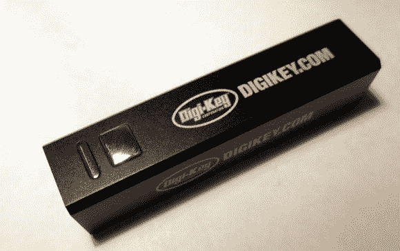

# 拆掉廉价的外置 USB 电池

> 原文：<https://hackaday.com/2014/04/03/tearing-down-a-cheap-external-usb-battery/>

[cpldcpu]最近收到了一个外部 USB 电池作为促销礼物，并认为将其拆下来查看其内部是一个好主意[。他一眼就能看出，这款设备包括一个用作 5V 输入(充电)的 USB micro-b 插座，一个用于 5V 输出的 USB-A 插座，一个指示有功功率输出的蓝色 LED 和一个指示充电的红色 LED。](http://cpldcpu.wordpress.com/2014/03/31/external-usb-battery/)

打开外壳发现，大部分空间被一个 2600mAH ICR18650 锂离子电池占据，连接到一个微小的 PCB。仔细检查和谷歌搜索让[cpldcpu]确定了后者的主要组件:一个电池管理 IC，一个 2A 升压转换器，一个 3A 肖特基二极管，几个 2A N-MOSFET，一个 300mA 2.5V LDO 和一个未知的 6 引脚 IC。非常有趣的是，这些组件似乎每一个都来自中国，这可能解释了为什么这个 USB 电池是免费的。你认为他们是在内部设计并外包制造，还是 Digi-Key 只是购买了一个产品并贴上他们的名字？

编者按:Digi-Key 是 Hackaday 的广告客户，但这篇文章不属于赞助范围。Hackaday 不发布赞助内容。

极其相似硬件的无关视频。[感谢詹姆斯的评论]

[https://www.youtube.com/embed/XDCSDTV0yUo?version=3&rel=1&showsearch=0&showinfo=1&iv_load_policy=1&fs=1&hl=en-US&autohide=2&wmode=transparent](https://www.youtube.com/embed/XDCSDTV0yUo?version=3&rel=1&showsearch=0&showinfo=1&iv_load_policy=1&fs=1&hl=en-US&autohide=2&wmode=transparent)