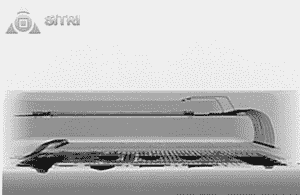

# 拆掉苹果手表

> 原文：<https://hackaday.com/2015/05/20/tearing-down-the-apple-watch/>

Apple Watch 已经推出近一个月了，但到目前为止，我们还没有好好看看这个电子珠宝的小金属饰品的内部。幸运的是，中国的一家公司正在努力探索苹果手表，并在此过程中发布一些令人难以置信的扫描电镜照片。

这并不是第一次苹果手表被拆——[iFixit 用螺丝起子和小螺丝刀拆了一块手表，并发现擅长处理小零件的人可能会更换这款手表的电池。对一个苹果产品来说，真的令人震惊。iFixit 还用 x 光看了看手表，揭示了 Apple Watch 的高级设计，芯片上的苹果 S1 计算机，以及这种可穿戴设备内部的所有传感器是如何工作的。](https://www.ifixit.com/Teardown/Apple+Watch+Teardown/40655)

A side view of a 6-DOF IMU

这次拆卸使用了大量非常高科技的设备来窥视 Apple Watch 的内部。正因为如此，这可能是展示这些微型传感器实际工作原理的最好例子之一。通过一些非常酷的图像，展示了一个 6 自由度 IMU，Knowles MEMS 麦克风是一个相对简单的小部件。

现在，苹果 S1，一个 26.15 毫米 x 28.50mm 毫米的微型芯片电脑，成为了苹果手表的大脑。它薄得惊人，只有 1.16 毫米，但仍然可以处理设备中的所有处理。

即使你不会购买这个电子配件，你也不得不尊重这个由半导体和传感器组成的小小金属小玩意所包含的惊人的工程数量。