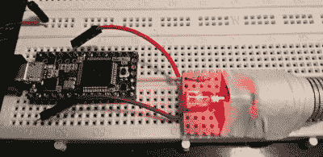

# Teensy 将 PDIF 加入图书馆

> 原文：<https://hackaday.com/2015/06/09/teensy-adds-spdif-to-library/>

有了 ARM Cortex M4 处理器上的 Arduino 库支持，我们成为 Teensy 3.1 的粉丝就不足为奇了。最近，[Paul Stoffregen]一直在为这个平台构建音频库，使它对我们当中的合成器/音频极客更有吸引力。现在，只需添加一个高亮度 LED 和一些软件，青少年就可以通过光纤输出数字音频。

[S/PDIF](https://en.wikipedia.org/wiki/S/PDIF) ，更具体地说是光学 TOSLINK，使用通过光纤传输的 LED 光来编码音频数据。与任何电压电平信号(如普通电线)相比，这种方法的优势在于，源设备和目的设备根本没有电气连接，从而消除了令人畏惧的接地环路嗡嗡声和任何 RF 干扰。

S/PDIF 的音频数据流有点复杂，但是如果你感兴趣的话，[Micah Scott]在她的博客上有一个关于它的精彩剖析。当然，你不需要了解任何这方面的知识，只需简单地将 S/PDIF 与 Teensy 音频库一起使用。

我们[热爱开源硬件和软件](https://hackaday.io/project/2984-teensy-audio-library/log/19120-spdif-digital-optical-toslink-output),因为这种合作使得像这样的利基事物的超快速发展成为可能。你可以在 PJRC 论坛上关注[青少年 S/PDIF 能力的发展。投稿人[Frank B]谦虚地宣称“所有的东西都已经在互联网上了”，但这并没有减少他们在几周内从零到工作图书馆的酷。(请注意预先计算的查找表在速度方面的巧妙使用。)](https://forum.pjrc.com/threads/28639-S-pdif)

在硬件方面，【保罗】已经[贴出了他的适配器板](https://www.oshpark.com/shared_projects/KcDBKHta)，这是一个便宜但看起来非常专业的光学 TOSLINK 发送器。但是，如果你感到孤立，你可以简单地使用一个红色的 LED 正好指向光缆。

最终结果？通过光束无损传输来自 Arduino-esque 微控制器的 CD 品质音频，成本低于 latté。