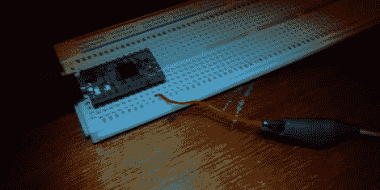

# 用作调幅无线电发射机的小板子

> 原文：<https://hackaday.com/2012/09/04/teensy-board-used-as-an-am-radio-transmitter/>

安格斯·麦金尼斯一直在研究调幅无线电传输技术。他尝试了一种使用 VGA 端口的方法，但发现垂直消隐是可以听到的。他最近的实验使用一块小小的微控制器板作为调幅发射机。

这不是一个独立的解决方案，而是他的笔记本电脑的硬件扩展。这是因为微处理器没有足够的周期来做更多的事情，除了通过 USB 读取字节并将它们的位推出 I/O 引脚之一。

为了获得稳定的数据流，他使用同步模式通过 USB 连接推送稳定的数据流。批量传输是另一种选择，但[Angus]发现这会导致音频抖动。每个字节每八个时钟周期馈入 AVR SPI 硬件一次。他的信号可以从房间的另一端接收到，但这是一个限制，因为 AVR 不会输出那么强的信号。但是构建一个简单的放大器应该是一个相当简单的练习。