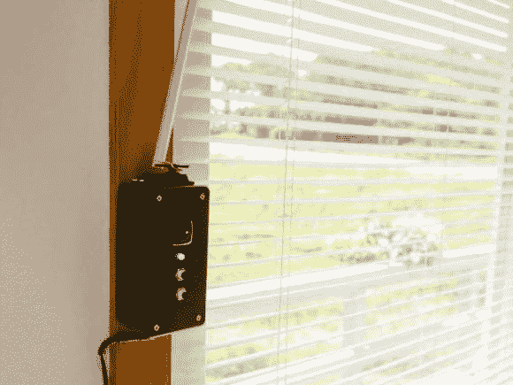

# 感温自动百叶窗

> 原文：<https://hackaday.com/2013/10/07/temp-sensitive-automatic-blinds/>

任何可以为你节省一些电费的机会都值得考虑，尤其是像[史蒂夫·霍弗的]迷你盲人看护器这样的设备。这个小家伙通过温度传感器监控房间并检查设定值来阻挡(或欢迎)阳光。如果房间太热或太冷，顶部安装的伺服系统将旋转魔杖，分别关闭或打开百叶窗。

[Steve]首先用一些 perfboard 制作了一个自制的 Arduino 屏蔽，并添加了一些分立元件:一些用于 RGB LED 指示灯的限流电阻和一个用于微调温度传感器的 10k 微调电位计。虽然这种构建放弃了 LCD 读数来显示精确的信息，但它确实通过从蓝色到红色的光谱步进 RGB LED 的颜色来提供反馈，以指示当前的室温与您的设定点相比如何。灯下方的两个瞬时按钮允许用户调高或调低设定值。

下面的视频详细介绍了如何建造自己的百叶窗，看看今年早些时候的一款类似的[自动百叶窗](http://hackaday.com/2013/04/18/hidden-servo-automates-slat-style-window-blinds/)，它可以根据环境光线打开和关闭。

[https://www.youtube.com/embed/YcR2yHHYzd8?version=3&rel=1&showsearch=0&showinfo=1&iv_load_policy=1&fs=1&hl=en-US&autohide=2&wmode=transparent](https://www.youtube.com/embed/YcR2yHHYzd8?version=3&rel=1&showsearch=0&showinfo=1&iv_load_policy=1&fs=1&hl=en-US&autohide=2&wmode=transparent)