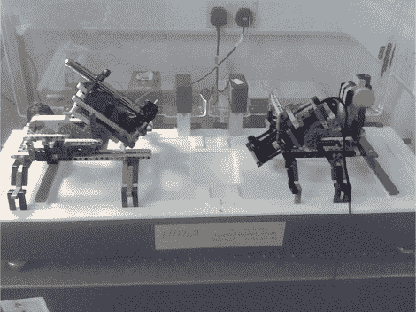

# 用乐高建造一个 BAM 显微镜节省了数万美元

> 原文：<https://hackaday.com/2012/10/01/tens-of-thousands-saved-by-building-a-bam-microscope-out-of-lego/>

一台布鲁斯特角显微镜(BAM)大约需要 10 万美元。如果你没有现成的，你可以用一些乐高积木来建造你自己的 T1。由于没有预算来购买硬件，并且需要数据来完成他的博士学位，【Matthew】想出了一个方法来以低廉的价格建造一些可以接受的东西。

这些显微镜将光源从水池反射到照相机的镜头上。问题是发送者和接收者的角度必须正好在 53.1 度。[Matthew]买得起一台二手相机，并开始试验一些实验室设备来安装钻机。但他就是无法调整好。因为他必须用手移动安装硬件，所以不可能不过度或不足拍摄校正。但是他突然灵光一现。乐高积木有非常精确的公差，你可以得到齿轮和电动部件。他将玩具的质量转化为 BAM，它的排列可以非常精确地调整。

可能看起来不太像，但是你可以在剪辑后看到硬脂酸漂浮在显微镜的视野中。这正是他需要进行的观察类型。当然，如果你只需要一个显微镜，你可以使用激光和一滴水。

[https://www.youtube.com/embed/3sRo2OKbT90?version=3&rel=1&showsearch=0&showinfo=1&iv_load_policy=1&fs=1&hl=en-US&autohide=2&wmode=transparent](https://www.youtube.com/embed/3sRo2OKbT90?version=3&rel=1&showsearch=0&showinfo=1&iv_load_policy=1&fs=1&hl=en-US&autohide=2&wmode=transparent)