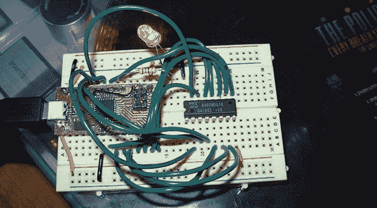

# 从 Commodore 测试 DRAM

> 原文：<https://hackaday.com/2013/10/12/testing-dram-from-a-commodore-64/>

几个月前，[乔希]得到了一个旧的准将 64。他需要制作一根 AV 电缆，并找到一个新的电源，即使在测试完这些新部件后，[Josh]发现它仍然无法启动。他不是一个对礼物吹毛求疵的人——或许他喜欢挑战——他着手修复一个有三十年历史的电路板。

他更换了一些芯片和盖子，但发现他没有办法测试 DRAM 芯片。与那个时代的其他计算机使用的 SRAM 或静态 RAM 相比，DRAM 有点难以接口，要求每个存储单元中的电容器每秒钟刷新几十次。在他的好朋友[CNLohr]的帮助下，[Josh]想出了一种读写他的芯片的电路，并基于 ATmega8U2 微控制器构建了一个小电路板用于测试目的。