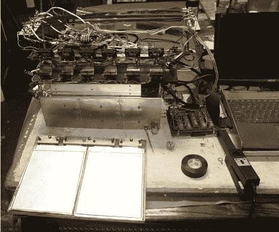

# 混合动力汽车用锂电池测试

> 原文：<https://hackaday.com/2012/06/29/testing-lithium-cells-for-use-with-a-hybrid-car/>

[Mikey]得到了一些 A123 袋细胞的真正交易。这些大型锂电池可承受 100A 放电和 50A 充电电流，一次充电寿命为 20 AH。他一直在做一系列的测试，以发现这些电池是否可以进入一个可扩展的电池组，并用于混合动力车。

我们刚刚参观了用于太阳能汽车阵列的电池测试仪。这是一个类似的情况，除了[Mikey]专注于测试数据，而不是仪器。上面的链接收集了他在测试中的笔记。从这一页的底部开始向上读，以便弄清楚时间顺序。他开始关注最有效的充电方法。由于细胞很快就超过了 100 华氏度，他马上就非常需要冷却。他继续用散热器和风扇进行测试，甚至带来了一台热成像相机来帮助设计。

[谢谢克里斯]