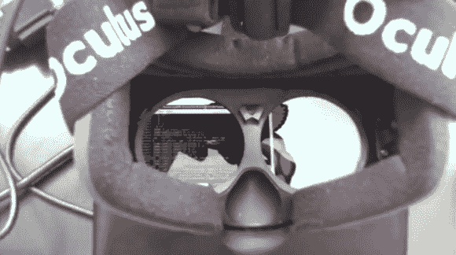

# 用树莓派测试虚拟现实极限

> 原文：<https://hackaday.com/2014/08/07/testing-vr-limits-with-a-raspberry-pi/>

虚拟现实的功能推动了我们感知存在的边界，欺骗大脑相信用户被推入的计算机生成的环境实际上包含一个真实的地方。因此，本着看看虚拟现实的可能性的精神，一位名叫[Jacques]的开发人员将[一个 Raspberry Pi 连接到 Oculus Rift](http://bitoniau.blogspot.fr/2014/04/oculus-rift-on-raspberry-pi.html)上。他使用一个叫做 [OpenGL ES](http://en.wikipedia.org/wiki/OpenGL_ES) 的计算机图形渲染 API 来渲染一个浮动的、旋转的立方体，这个 API 很像当今任何一个移动平台。

他的所有测试都是在一个发布版本上完成的，该版本利用了官方的顶点和片段着色器。没有试图优化任何东西；反正也没什么事可做。场景以每帧 16 毫秒的速度渲染两次。从那里，他尝试了 27 毫秒每帧的纹理，接着是 36 毫秒每帧，然后是 45 毫秒。

使用的代码可以在[【雅克】的 Github 账号](https://github.com/jbitoniau/RiftOnThePi)上找到。一个简单的改进是使用一个[香蕉 Pi](http://www.zdnet.com/banana-pi-the-next-generation-of-single-board-computers-7000028790/) 来提高处理速度。然而，不要期望这种类型的设置会有什么惊人的结果。实际上，该项目只是证明了将虚拟现实体验最小化为便携的东西是可能的。同样，如果事情没有妥善安排，Pi + Oculus 集成会产生[不舒服的滞后效应](http://hackaday.com/2014/04/29/what-if-you-experienced-lag-in-real-life/)。但是，一旦能源/计算能力问题得到解决，VR 设备可能会转变为一种更时尚的产品，比如谷歌眼镜，只要轻轻一按开关，就可以将 VR 和 AR 之间的视图切换为更混合的视图。然后，像这个 [Kinect-mapping 太空实验](http://hackaday.com/2014/06/21/virtual-physical-reality-with-kintinuous-and-an-oculus-rift/)这样的运动感应输入相机可以让世界各地的人们跳入其他推动现实的探险家的视角。虽然这一切都还很遥远，但这个项目为未来可能发生的事情奠定了基础。

要查看[Jacques]的完整设置，请在休息后观看视频。

[https://www.youtube.com/embed/69mZpevHiRA?version=3&rel=1&showsearch=0&showinfo=1&iv_load_policy=1&fs=1&hl=en-US&autohide=2&wmode=transparent](https://www.youtube.com/embed/69mZpevHiRA?version=3&rel=1&showsearch=0&showinfo=1&iv_load_policy=1&fs=1&hl=en-US&autohide=2&wmode=transparent)