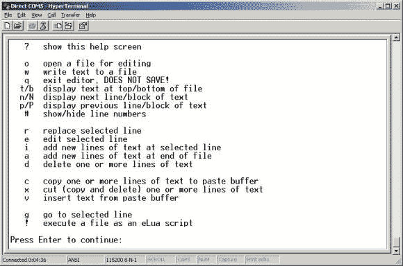

# 在您的 ARM 项目上运行的文本编辑器

> 原文：<https://hackaday.com/2013/07/11/text-editor-running-on-your-arm-project/>

厌倦了一遍又一遍地刷新您的嵌入式项目，只是为了调整一些值吗？[Karl]也是，所以他写了[一个文本编辑器，在他的 ARM 开发板](http://www.seanet.com/~karllunt/elua_editor.html)上运行。

对这种事情的需求感到困惑吗？他实际上是在玩 [eLua](http://www.eluaproject.net/) ，嵌入式版本的 [Lua 编程语言](http://www.lua.org/)。在这种情况下，程序文件存储在 SD 卡上。但是，在计算机和嵌入式项目之间来回移动很快就过时了。所以他花时间编写了一个基本的文本编辑器，通过这个终端窗口进行交互。上面你可以看到帮助屏幕，展示了所有的应用功能。现在听起来唯一的问题是它需要运行的内存量。按照现在的情况，编辑现在可以运行 mbed 板，但是它在[的 STM 发现](http://hackaday.com/2012/11/15/in-depth-comparison-at-stm32-f3-and-f4-discovery-boards/)上运行得很好。