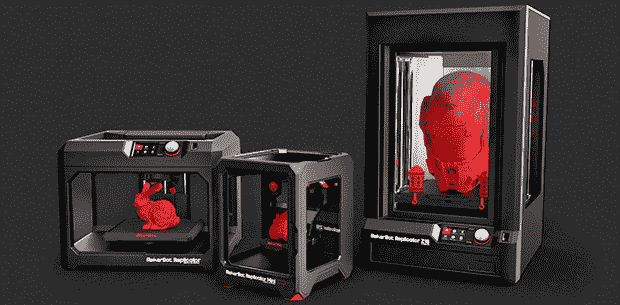

# MakerBots 的 2014 系列

> 原文：<https://hackaday.com/2014/01/10/the-2014-line-of-makerbots/>

随着消费电子展的结束，终于到了看一看 MakerBot 打印机新系列的时候了。不同于 MakerBot 以前的一刀切的商业模式，他们的产品线只能被描述为“常规、小型和大型”。

新的 MakerBots 包括一个更新的复制器,比以前的版本稍微大一点。它包括以太网、一个 WiFi 选项、一个车载摄像头和一个带 3.5 英寸 LCD 和旋转编码器的控制面板。这种新的复制器零售价为 2900 美元，比目前的复制器(单挤出机)高出 700 美元。

其他新的 MakerBots 包括精简的小型[复制器迷你](http://store.makerbot.com/replicator-mini)。这是一台简单的机器，体积为 10 x 10 x 12.5 厘米(约 4 x 4 x 5 英寸)，分辨率为 200 微米。新阵容中还有[复制器 Z18](http://store.makerbot.com/replicator-z18) ，这是一款令人印象深刻的大型打印机，具有 30.5 x 30.5 x 45.7 厘米(12 x 12 x 18 英寸)的构建体积，100 微米的分辨率，塑料侧面用于加热构建体积，以及新复制器上的所有功能。Mini 售价为 1375 美元，Z18 预计售价为 6500 美元。

更新的 Replicator 现已上市，Mini 和 Z18 将在未来几个月内上市。