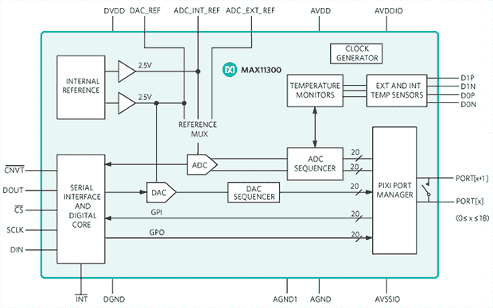

# 模拟瑞士军刀

> 原文：<https://hackaday.com/2014/06/19/the-analog-swiss-army-knife/>

虽然 FPGAs 因成为时髦的新事物而获得了所有的赞誉，但它们本质上是数字设备。没有合适的 ADC 和 DAC，您就无法利用可编程逻辑深入模拟领域。Maxim 刚刚推出了一款芯片来实现这一功能:一把模拟瑞士军刀，有 20 个引脚，可配置为模数转换器、数模转换器、GPIO 或以上任意组合。

MAX11300 包括 20 个 IO 端口，每个端口都可以成为 ADC、DAC 或 GPIO，成对的端口可以配置为逻辑电平转换器或模拟开关。ADC 和 DAC 均为 12 位，输入和输出范围为-10V 至+10V。

作为一个不错的小奖励，该芯片是通过 SPI 控制的，这使它成为一个有趣的小型“做任何模拟”工具，我们确信它将在今年年底前上市。幸运的是，Maxim 有一个很好的 GUI 来配置芯片上的 20 个引脚，当然 Maxim 已经为 MAX11300 提供了评估套件。它的价格是 100 美元，并且只适用于 Windows。

MAX11300 提供 40 引脚 TQFN 或 48 引脚 TQFP 封装(稍后将提供更大、更容易焊接的 TQFP ),千片订量约为 5.80 美元，[或 11.37 美元。下面的视频展示了 MAX11300 读取和写入模拟值到几个引脚，并很好地了解了配置软件。](http://www.mouser.com/Search/Refine.aspx?Keyword=MAX11300)

[https://www.youtube.com/embed/3VYW-JatU7I?version=3&rel=1&showsearch=0&showinfo=1&iv_load_policy=1&fs=1&hl=en-US&autohide=2&wmode=transparent](https://www.youtube.com/embed/3VYW-JatU7I?version=3&rel=1&showsearch=0&showinfo=1&iv_load_policy=1&fs=1&hl=en-US&autohide=2&wmode=transparent)