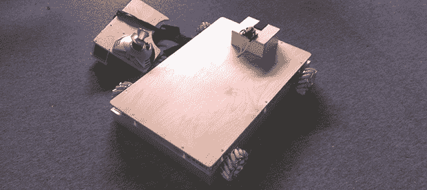

# 自动泊车麦克纳姆机器人

> 原文：<https://hackaday.com/2014/03/28/the-auto-parking-mecanum-robot/>

不久前， [Hackaday 参观了位于加利福尼亚州格伦代尔的克拉克磁铁学校](http://hackaday.com/2014/01/28/hackaday-visits-the-clark-magnet-high-school/),一睹他们以 STEM 为重点的课程、第一机器人俱乐部、令人敬畏的视听教室和一家让大多数黑客相形见绌的商店。我们在那里的时候看到了一些构建，但是[杰克]的自动泊车麦克纳姆机器人是独一无二的。它应该有自己的黑客日帖子，现在[杰克]正在进行黑客日项目，[他正在分享所有的细节](http://hackaday.io/project/70-Auto-Parking-Mecanum-Robot)。

最令人印象深刻的是麦克纳姆车轮；车轮的侧板由[杰克]自己设计，并在他学校的哈斯工厂加工。当盘子从工厂出来时，它们是平的，盘子上的 15 个小标签中的每一个都需要弯曲 45 度角。有了数控夹具和大量的时间，[杰克]弯曲所有八个板块的标签。

除了板，[辊是定制的](http://hackaday.io/project/70/log/141)，由注入 CNC 铣削模具的不可膨胀聚氨酯制成。那是一个整体模具；[杰克]需要做 60 个这样的小零件，一次一个。

电子设备是围绕通过 XBee 与操纵杆通信的 Arduino Mega 构建的。[杰克]发现现成的电机板中的继电器无法处理电流，所以他用大得多的继电器取代了它们，这是一项我们可以自豪地称之为自己的杰作的黑客工作。也有一点点的代码，让这个机动化的车拉了最好的平行停车工作，任何人都可以希望。你可以看到这一点，以及下面的几个视频。

[https://www.youtube.com/embed/3Bw4-VmBGwg?version=3&rel=1&showsearch=0&showinfo=1&iv_load_policy=1&fs=1&hl=en-US&autohide=2&wmode=transparent](https://www.youtube.com/embed/3Bw4-VmBGwg?version=3&rel=1&showsearch=0&showinfo=1&iv_load_policy=1&fs=1&hl=en-US&autohide=2&wmode=transparent)

[https://www.youtube.com/embed/Vn5qu2cNxPU?version=3&rel=1&showsearch=0&showinfo=1&iv_load_policy=1&fs=1&hl=en-US&autohide=2&wmode=transparent](https://www.youtube.com/embed/Vn5qu2cNxPU?version=3&rel=1&showsearch=0&showinfo=1&iv_load_policy=1&fs=1&hl=en-US&autohide=2&wmode=transparent)

[https://www.youtube.com/embed/N9X_JMFBTRg?version=3&rel=1&showsearch=0&showinfo=1&iv_load_policy=1&fs=1&hl=en-US&autohide=2&wmode=transparent](https://www.youtube.com/embed/N9X_JMFBTRg?version=3&rel=1&showsearch=0&showinfo=1&iv_load_policy=1&fs=1&hl=en-US&autohide=2&wmode=transparent)