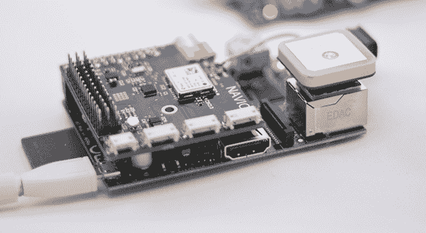

# 树莓派的自动驾驶防护罩

> 原文：<https://hackaday.com/2014/06/04/the-autopilot-shield-for-the-raspberry-pi/>

在无人机、四轴飞行器和无人飞行器的世界中，社区已经基本上确定了低端的 AVR 微控制器和高性能板的 ARM。如果联邦航空局不把事情搞砸，很快就会出现另一个需要更多计算能力的市场，而为 Pi 提供自动驾驶保护的 [Navio 正是它需要的东西。](http://www.emlid.com/blog/)

像 [OpenPilot Revolution](http://www.openpilot.org/products/openpilot-Revolution-platform/) 这样的高端多翼机和自动驾驶仪板使用 ARM 微处理器，这一爱好中有一小部分要求很高，需要更多的处理能力。想想类似于[内陆挑战赛](http://www.uavoutbackchallenge.com.au/)的事情，固定翼无人机在沙漠中自主搜索丢失的人体模型。为此你需要 OpenCV，也就是 Linux。

Navio 是 Raspberry Pi 的保护罩，配有气压传感器、陀螺仪、加速度计、指南针和 GPS。它旨在运行更加实时的 Linux 版本，并能够进行一些有趣的遥测配置——在 Navio 上安装 3G 调制解调器不是什么大问题，因为它是一个 Raspi，对向下摄像头进行图像处理只是编写代码的问题。

Navio 团队[目前正在开展 Indiegogo 活动](https://www.indiegogo.com/projects/navio-autopilot-shield-for-raspberry-pi)，基线版本售价 145 美元。这非常接近 OpenPilot 革命的价格。还有一个升级了 U-blox NEO-6T 的版本，允许对原始 GPS 数据进行机载处理。