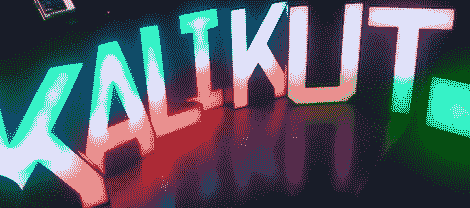

# 乐队的名字在灯光，准确地说是 RGB LEDs。

> 原文：<https://hackaday.com/2012/11/08/the-bands-name-in-lights-rgb-leds-to-be-exact/>

[michu]的几个朋友现在组建了一个名为 Kalikut 的乐队，他们需要一场精彩的舞台表演。乐队用他们的乐队名做了几个 80 厘米高的字母，剪了几片丙烯酸，用几个 LED 模块连接起来。将这些字母连接到电脑上并编写程序的工作落在了[michu]身上，我们不得不说[他做得相当好](http://neophob.com/2012/11/kalikut-now-stage-design/)。

你可能还记得[michu]的[striping vaders](http://hackaday.com/2011/12/26/stripinvaders-puts-colored-lights-everywhere/)和[PixelInvaders](http://shop.pixelinvaders.ch/product/pixelinvaders-diy-basic-pack)项目，基本上是一些 RGB LED 模块，可以通过 SPI 接口与 Arduino 通信。对于这些巨大的字母，[michu]遇到了一个问题:他的时钟和数据线之间有 11 米长的电缆，远远超过了任何数据表的最大建议长度。

[michu]在互联网上寻找 SPI 接口的常见问题，并从许多非常聪明的人那里找到了许多好的建议。SPI 总线的问题[最终通过*正确地*连接他的 LED 模块的地线，建立几个非常简单的 SPI 缓冲器，并降低 SPI 总线的时钟速度](http://neophob.com/2012/04/long-distance-spi-installation-lessons-learned/)得到了解决。

无数个小时后，乐队的名字出现在灯光和 RGB LEDs 上。一切都可以通过 Abelton Live 控制，休息后的视频看起来绝对精彩。

[//player.vimeo.com/video/53030410](//player.vimeo.com/video/53030410)