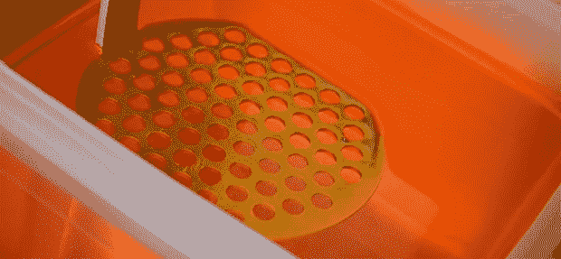

# 3D 树脂打印机时代的开始

> 原文：<https://hackaday.com/2014/06/21/the-beginning-of-the-age-of-3d-resin-printers/>

几年来，基于细丝的塑料打印机已经统治了业余爱好者市场，Kickstarter 上每周都会出现喷射塑料的新版本。SLA 打印机具有更高的分辨率和历史上较高的原材料价格，一直处于幕后，等待时机的到来。

现在，随着 Sedgwick 打印机[在 Kickstarter](https://www.kickstarter.com/projects/sedgwick/sedgwick-3d-dlp-printer) 上可用，我们可能最终会看到一些树脂打印机进入世界各地的黑客空间和工作室。不同于其他基于 DLP 投影仪的树脂打印机，投影仪的光线通过树脂罐照射，塞奇威克的创造者[Ron Light]正在用传统的方式做事情:将投影仪照射到树脂表面。他说，这是一个更简单的方法，鉴于他能够以 600 美元的价格运送一套 Sedgwick 工具包，但不包括投影仪，他可能会有所发现。

还有一些其他的树脂打印机即将登场——little SLA 将很快看到自己的 Kickstarter，[mUVe 1 已经开始发货](http://www.muve3d.net/press/product/muve-1-3d-printer/)，在 Hackaday 项目上，[open exposer](http://hackaday.io/project/1129-OpenExposer)项目进展顺利。对于任何想要轻松获得高质量打印的人来说，这都是非常好的消息。