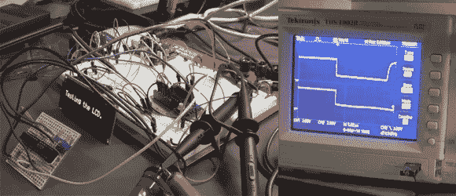

# LCR 米的起源

> 原文：<https://hackaday.com/2014/03/15/the-beginnings-of-an-lcr-meter/>

电感是一种经常被遗忘的无源电子元件，用于设计模拟电路。[Charles 的]最新概念证明演示了如何用示波器测量电感,希望能制作出基于 PIC 的 LCR 计。

人们并不经常需要测量电感，但电感用于开关调节器、电机电路、[无线](http://hackaday.com/2014/01/06/automatic-antenna-tuner/)设计、模拟音频电路以及许多[其他](http://hackaday.com/2012/05/08/metal-detection-using-an-inductor-instead-of-a-clock-crystal/)类型的[项目](http://hackaday.com/2013/05/20/adding-leds-to-an-engagement-ring/)。测量电感的原理可以用来测试你自己做的[电感](http://hackaday.com/2011/09/22/beginner-concepts-a-quartet-of-videos-on-inductors/)，甚至可以用这些知识来测量电容。

[Charles]最初看到了[Alan]关于如何测量阻抗的一个很棒的[指南，并决定采用这个想法。当你可以制造一个 LCR 流量计时，为什么要花 200 多美元呢？就是这种精神！休息之后一定要看[艾伦的]和[查尔斯的]视频。为了省钱，你都造过什么样的测试设备？](https://www.youtube.com/watch?v=74fz9iwZ_sM)

https://www.youtube.com/watch?v=74fz9iwZ_sM

[https://www.youtube.com/embed/_UuhMzf1oj4?version=3&rel=1&showsearch=0&showinfo=1&iv_load_policy=1&fs=1&hl=en-US&autohide=2&wmode=transparent](https://www.youtube.com/embed/_UuhMzf1oj4?version=3&rel=1&showsearch=0&showinfo=1&iv_load_policy=1&fs=1&hl=en-US&autohide=2&wmode=transparent)