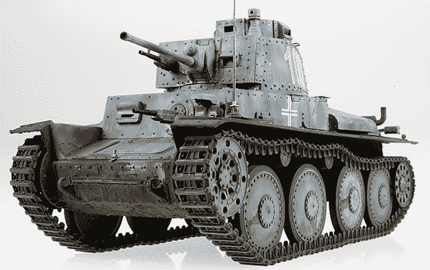

# 展示非常小的东西的最佳照相亭

> 原文：<https://hackaday.com/2013/07/05/the-best-photo-booth-for-really-small-stuff/>

[杜古]制作塑料模型，像任何制作小东西的人一样，他需要一个好的照相亭来展示他的产品和技术。他在用我们一起组装的非常普通的“海报板和工作灯”装置工作，但在 PS 了太多次接缝线后，他决定[将他的展位](http://doogsmodels.com/2013/07/03/photo-studio-upgrade/)升级到稍微好一点的东西。

新的装置包括一个铝框架，一片 40×80 英寸的半透明有机玻璃形成了展台的底部和背景。漫射袋中的两盏灯从顶部照亮主体，而旧工作灯安装在桌架底部，从下方照亮主体。

与过去的“海报板和工作灯”技术相比，[杜古]的新摄影亭对于拍摄非常小的东西来说绝对是令人难以置信的。这架喷火式战斗机的模型看起来像是在漂浮，而[这架闪电](http://farm8.staticflickr.com/7415/9196462499_5e86096e60_z.jpg)足以登上杂志封面。

当然，这个照相亭不仅仅局限于模型，所以如果你想在未来拍摄一些手工焊接 BGA 电路的照片，你可能需要考虑升级你的工作室设置。