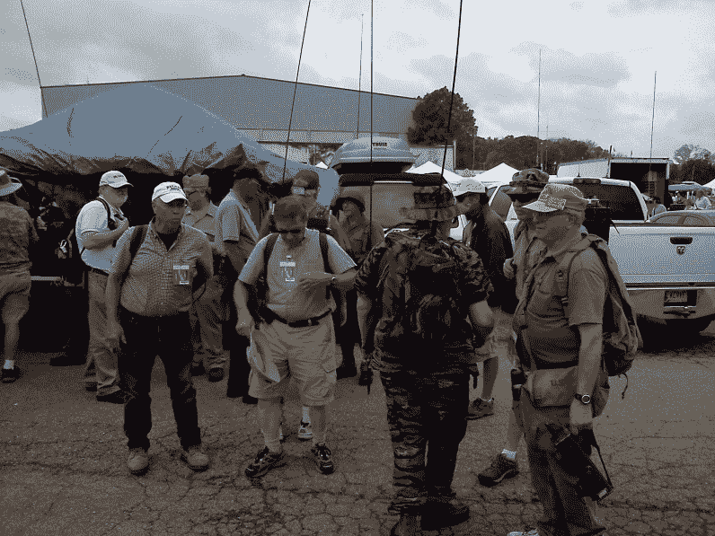

# Hamvention 最重要的一天

> 原文：<https://hackaday.com/2015/05/17/the-biggest-day-at-hamvention/>

我们以一场意想不到的阵雨和在酒店房间里的电弧结束了第二天的活动。历史上， 周六 是展会上座率最高的一天。像往常一样，我们大部分时间都在外面的跳蚤市场。我们的一个朋友允许我们使用他的 AN/GRC-9 军用无线电检查其中一个网络。这台收音机是由手摇曲柄驱动的。后来，我们参加了一个关于野营旅行用高频天线构造的论坛，并在房间里为我们的项目获得了零件。晚点再说吧。总的来说，很棒的一天。

今天早上的会议上天线坏了，无线电波在空中传播。我们遇到了其他一些 Hackaday 的粉丝，包括[[Jennifer Estrada](https://twitter.com/estradjm89)]，他正在从事低功耗雷达和软件定义无线电项目。

Antennas across the Hamvention on Saturday morning.

#### 修理然后入侵新泽西号航空母舰的无线电设备

战舰新泽西业余无线电台的成员们恢复了美国军舰新泽西号(BB-62)的通信能力，并把船上的无线电室调到了业余无线电波段。该小组已经将功能设备连接到五个原始天线，并使船上的无线电室可以运行，同时尽可能保持历史正确性。在 www.nj2bb.org 了解更多信息

  PSK 31 messages being displayed on the USS New Jersey’s computer system.  USS New Jersey, full broadside.  Many of the subsystems beyond just the radio room were repaired by the amateur radio group.  

这个组织对美国海军新泽西号无线电室的一个著名的攻击是让船上旧的数字通信系统自动显示来自世界各地业余无线电操作员的 PSK31 消息(见上图，绿色屏幕的计算机终端显示 PSK31 消息)。

点击休息时间，了解更多关于 Hamvention 的内容！

#### **太空中的业余无线电**

hams 在业余无线电界之外并不出名，自 20 世纪 70 年代以来，他们一直在建造卫星并将其送入轨道。它们的作用就像轨道上的中继器，允许其覆盖范围内的任何两个站同时通话？立方体卫星是最新的创新，将全部功能放入微小的包装中。

    

#### **绿色无线电财源**

军事背包/绿色无线电小组是这个爱好中发展最快的亚文化之一。通常情况下，背上几十磅(某种)过时的装备被认为是军事劳动，但火腿享受一个很好的挑战。在野外条件下工作，有时只有几瓦的功率，迫使我们专注于无线电技术，而不是功能越来越丰富的设备。

  This radio is the predecessor to the BC611, the first true handheld two-way radio.    

#### **技术研讨会**

Hamvention 主办了 1-2 小时的简短研讨会，讨论业余爱好者感兴趣的话题。今年的主题从卫星工作入门，到数字操作模式、天线工艺、应急通信以及你在进行无线电野营时可以随身携带的天线。该节目的特色是与宇航员[迈克尔“迈克”芬克]的现场谈话和问答。

    The PCB layout of the $25 network analyzer, stay tuned for more information on this in the next 6 months or so.

在参加“HF 天线构造”研讨会时，我们了解到一种新的低成本(目标价格为 25 美元)网络分析仪，该分析仪已作为原型进行了开发和测试，其中使用惠斯通电桥和简单的数字信号源进行测量。这款器件适合业余爱好者使用，因为动态范围不是很重要。

#### **教育推广**

ARRL 教育和技术项目向高中教师开放，让他们学习如何向学生展示无线技术在非常实际的场景中是如何工作的。在这个例子中，学生和教师使用业余无线电建造了一个海洋研究浮标，以便将环境数据远距离传送回陆地。

      

国家美国之音博物馆在现场展示他们最新的电磁学和电学互动演示。下面是一些法拉第马达和一个互动手摇发电机游戏，只是美国之音广播博物馆科学展览的两个例子。

    

#### **穿苏格兰短裙卖天线的男人**

天线？检查。短裙？检查。Radiowavz([www.radiowavz.com](http://www.radiowavz.com/))的天线和他们五颜六色的零售人员。其中一位作者[Scott，KC8KBK]在家中使用了他们的一种产品，并与从南美到东欧的电台进行了交谈。

#### **所有车辆的新测试装置**

该展会不仅是展示最新无线电和天线设备的场所，也是寻找最新测试设备的地方，包括。Seeed 与 Rigol 等其他大公司一起展示了他们新的小型低成本频谱分析仪和信号发生器系列。

    

#### 明天是会议的最后一天

现在或永远不要让供应商卖掉最后一个船锚，让与会者找到他们不能没有的那件装备。许多交易和有趣的故事将会在明天发生，对于那些愿意谈判、四处挖掘、把沉重的东西拖回他们车上的人来说。