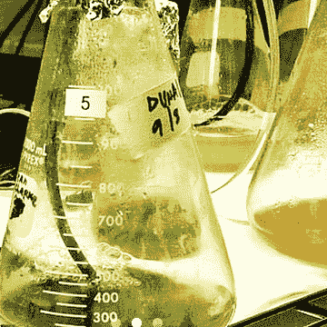

# 生物黑客运动和开源胰岛素

> 原文：<https://hackaday.com/2015/07/30/the-biohacking-movement-and-open-source-insulin/>

2014 年 3 月，我知道我八岁的女儿生病了。她一度超重，现在瘦得皮包骨头，渐渐离我们远去。一辆黎明前开往医院的救护车给了我们一个毁灭性的消息——我们的女儿患有 1 型糖尿病，她将在余生依赖胰岛素注射。

这个消息对我打击特别大。我一直是那种有备无患的人，我努力把自己和家人从尽可能多的支持系统中解放出来。当我坐在儿科重症监护室的黑暗中，看着我的女儿慢慢回到我们身边时，我想到了我刚刚变得多么依赖医疗系统。她将需要持续供应昂贵的胰岛素，由医疗保险系统发放，该系统不明白 90 天的救命药物供应对一个储存一年卫生纸的人来说是个笑话。另外，我最近读了一本启示录小说，书中一位父亲看着他 12 岁的糖尿病女儿陷入昏迷，因为她现在无法获得的最后一点胰岛素在一个与外界隔绝的世界里变质了。我对自己发誓，我绝不会让这种事情发生，并开始尝试寻找自己制造胰岛素的方法，以防万一。

## 维克多的黑客，伊娃的胰岛素

![Eva and Victor Saxl [Source: The Eva Saxl Story]](img/0cda3a4c2cd77ef14b403511ac92c67e.png)

伊娃和维克多·萨克斯尔【来源:[伊娃·萨克斯尔的故事](https://vimeo.com/30873453)

认为胰岛素无法商业化的那一天永远不会到来？这可能是伊娃和维克多·萨克斯尔的想法，但他们了解到情况并非如此。20 世纪 30 年代末，萨克斯一家是生活在捷克斯洛伐克的一对年轻犹太夫妇。他们看到了不祥之兆，设法在希特勒的坦克之前逃出了这个国家。好时机，但不幸的执行，因为他们最终在日本占领的上海。年仅 19 岁的伊娃刚刚被诊断出患有 1 型糖尿病，由于日本加强了对上海犹太人区的控制，她现在无法合法获得胰岛素。

维克多是一名纺织工程师，没有正规的生物学背景，他自己想办法解决了这个问题。从牛的胰腺中首次分离出胰岛素还不到 20 年，所以维克多研究了这一过程，从一位中国朋友那里借了一些实验室空间，最终成功地从水牛胰腺中制造出一种暗褐色的液体。没有办法测试他的混合物，他把它注射到他生病的妻子体内，等待着，不知道他的半净化污泥是否会杀死她。它没有。事实上，随着血糖的下降，她变得活跃起来。维克多破解的胰岛素挽救了他年轻妻子的生命，随着产量的增加，又拯救了 400 多名难民。伊娃和许多难民都活到 80 多岁。

萨克斯的故事激励我开始收集从哺乳动物胰腺中提纯胰岛素所需的材料。我的背景是生物学，我在实验室呆了很长时间。我想我可以处理切碎组织、提取和提纯这些棘手的事情。毕竟，复制 20 世纪 20 年代最初提纯胰岛素的实验室的工具和材料有多难？

事实证明，这不是不可能的，但也不容易，因为工作、家庭、房子和现在学习如何传统地管理糖尿病的竞争需求，我没有取得多大进展。另外，我知道全组织提取物有多挑剔，最后，即使我设法得到了相对纯的胰岛素，它也不是牛或猪的激素，而不是人的。这让我的努力有点受挫，它变成了一个次要的项目。

## 通过分子生物学更好地生活

[![Six-subunit storage form of insulin [Source: Wikipedia]](img/b782bd5dbf9a3d5b33d60078b720775b.png)](https://hackaday.com/wp-content/uploads/2015/07/insulinhexamer.jpg) 

胰岛素的六亚单位储存形式【来源:[维基百科](https://commons.wikimedia.org/wiki/File:InsulinHexamer.jpg)

几周前，我又开始思考 DIY 胰岛素生产。我知道商业制备的胰岛素不再从哺乳动物的胰腺中分离出来。自从 1978 年基因泰克公司首次将人类胰岛素基因植入细菌后，这种做法就几乎被放弃了。该基因由质粒携带，质粒是可以插入细菌或酵母的 DNA 小环。在适当的条件下，由质粒上的基因编码的蛋白质可以由细胞产生和分泌。培养大量这样的细胞，你就会得到大量的人类胰岛素。从细胞培养物中纯化胰岛素并不简单，但至少与全组织提取物相比，这相对简单。重组技术还允许对蛋白质的序列进行修改，这不仅改变了它在体内的效果，例如它的吸收速度，而且还允许进行修改，使它比整个组织中的胰岛素更容易纯化。

我在实验室老鼠时代也有丰富的分子生物学经验。我制造了相当数量的质粒，培养了大量重组大肠杆菌，并从中纯化出蛋白质。在我看来，这是一条更容易的路。我开始思考我需要些什么来在家里组装一个分子生物学实验室，并开始学习如何生产人类胰岛素。事实证明，我不是唯一一个有这种想法的人。

## 开源胰岛素

一个朋友最近给我发了一篇关于自制胰岛素的文章，这让我非常兴奋，至少在最初是这样。这篇文章有一个令人窒息而又慎重的标题，[“生物黑客旨在自制胰岛素，但还不要尝试”](http://www.npr.org/sections/health-shots/2015/07/15/422935288/biohackers-aim-to-make-homebrew-insulin-but-dont-try-it-yet)，并围绕企业家和 [Indie 创始人的努力展开。生物](http://sf.indiebio.co/) Ryan Bethencourt 使用基于云的平台开发开源胰岛素。他的最终目标是分散生产胰岛素，免费提供给每个需要的人。

 

【来源:[BioCurious.org](http://biocurious.org/)

到目前为止，使用合作、开源模式生产胰岛素的有组织的努力似乎集中在获得足够的资金来支付原型和初始实验。但这似乎也是经过深思熟虑的基本计划，解决了根本问题:让细胞表达胰岛素很容易，但将其纯化到足以杀死糖尿病患者却不容易。为此，额外的氨基酸将被附加到胰岛素上，以使其在更少的步骤中被纯化。

致力于开源胰岛素的生物黑客很快指出，他们最初所做的只是严格的研究——公民科学家正在研究一个有趣的生化过程并分享他们的结果。但是最终目标是什么是很清楚的，值得思考的是，如果我们到达了在家生产胰岛素就像酿造一批波特酒或拉格啤酒一样简单的地步，这个世界会是什么样子。鉴于我从大多数内分泌学家那里得到的反应，我试图与他们讨论标准胰岛素疗法的哪怕是最轻微的变化，我无法想象医学界会张开双臂欢迎这样的创新。尽管如此，我认为生物黑客会勇往直前，当他们到达那里时，会跨过监管的桥梁。

## 生物黑客的黑仔应用程序

[![Bio-luminescence experiment [Source: BioCurious.org]](img/52c031099e2d192f4deb9307ad956a27.png)](https://hackaday.com/wp-content/uploads/2015/07/biocurious-biolum.png) 

生物发光实验【来源:[BioCurious.org](http://biocurious.org/)

说实话，现在生物黑客运动似乎有点奄奄一息了。当然，网上列出了相当多的生物黑客团体，但是揭开表面，你会发现这些团体的相当多的网站多年来没有更新，有几个带有“Lorem ipsum”标记，从未完成。公平地说，世界各地有很多创客空间，里面有装备了生物和化学实验的湿实验室，一些生物黑客团体，如 [BioCurious](http://biocurious.org/) 和 [Genspace](http://genspace.org/) ，似乎充满活力，富有成效。但就我所见，生物黑客并没有实现更多传统创客领域所拥有的突破。我觉得这和“杀手级 app”效应有很大关系；例如，在 VisiCalc 和 Lotus 1-2-3 问世之前，个人电脑的销售在 80 年代并没有爆炸式增长。我认为负担得起的 3D 打印是一个杀手级应用，它让创客运动真正获得了动力，并导致创客开始联合成团体。生物黑客还没有它的杀手级应用。

也许开源胰岛素正是这个领域所需要的，来激发公民科学家的创造力，让事情运转起来。不过，就目前而言，生物黑客和开源胰岛素似乎正处于爆发的边缘，这让我感到鼓舞。我的女儿出生于 2005 年，可以想象她能活到 22 世纪的黎明。她需要大量的胰岛素才能坚持到那一步，我想在接下来的 85 年里，她不会被束缚在一个集中的医疗系统中。谁知道呢——也许她会染上生物黑客的毛病，成为一股创新浪潮的先锋，帮助她在某一天制造出自己的胰岛素。