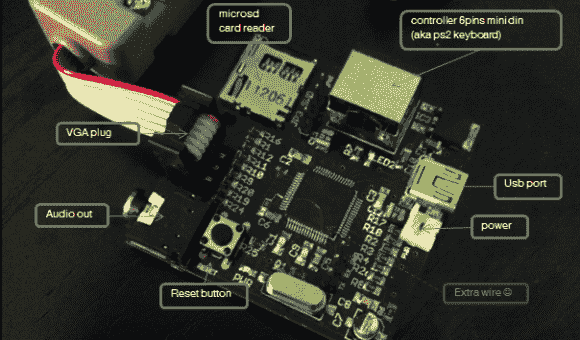

# Bitbox 控制台:一个开源游戏平台

> 原文：<https://hackaday.com/2013/09/18/the-bitbox-console-an-open-source-gaming-rig/>

驱动 VGA 显示器只需要一个简单的阻性 DAC。结合片内音频 DAC，STM32F405RGT6 看起来是 DIY 游戏主机的不错选择。[Makapuf][bit box 控制台](http://bitboxconsole.blogspot.com/ "Bitbox Console")是一款基于 STM32 ARM 处理器的单芯片游戏机。

我们过去见过一些 DIY 游戏机。Uzebox 是一款流行的 8 位开源游戏系统，[makapuf]的设计灵感来自于它。他的游戏机使用更强大的 32 位处理器，可以玩更复杂的游戏。它还将提供更多的颜色和更高质量的音频。

Uzebox 成功的关键之一是围绕它的开发工具。有一个完整的[模拟器](http://uzebox.org/wiki/index.php?title=Emulator "Uzebox Emulator")，允许用 GDB 进行调试。[Makapuf]已经建立了一个基于 [SDL](http://www.libsdl.org/ "SDL") 的模拟器，可以使用 GDB 远程调试目标。这肯定会加快游戏开发的速度。

休息之后，看看 Bitbox 的第一个游戏的演示:JUMP。另外，请务必通读[makapuf]的博客，了解关于构建的详细信息。

[https://player.vimeo.com/video/74706567](https://player.vimeo.com/video/74706567)