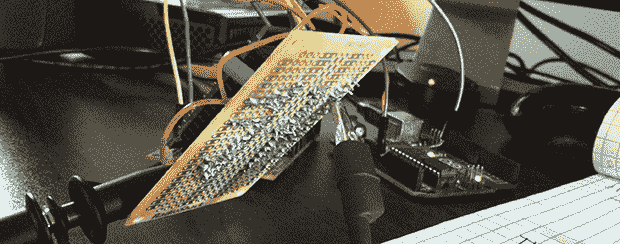

# 硬件随机数发生器的研制

> 原文：<https://hackaday.com/2014/06/08/the-development-of-a-hardware-random-number-generator/>

[伊恩]需要大量的随机数。就 RNG 而言，有几十种商业产品，但对于电子爱好者来说，也有数百种不同的方式在串行端口上拍摄随机位。其中一种方法是基于 PN 结中雪崩击穿噪声的 RNG。就像业余爱好者的电子产品中的任何电路一样，网上有几十个原型，但没有太多完成的项目。[Ian]决定建造一个这样的 RNG 作为原型，然后[把它变成一个类似于成品的项目](http://iank.org/trng.html)。

雪崩噪声 RNG 利用了这样一个事实，即强烈反向偏置的 PN 结(如晶体管中的 pn 结)将产生一种情况，其中一个电子将另一个电子撞出原位，导致持续的连锁反应。它是量子的，它是混沌的，它是随机数发生器的一个很好的来源，在互联网上已经有几十个原型电路。

[Ian]从[Will Ware]的这些电路设计中选取了一个[,并开始了最终设计的迭代。第一轮是带有基本电路和电源的简单 PCB。只有几个晶体管、电阻和一个 DC/DC 升压转换器。确认电路正在产生噪声，下一次迭代引入了一个 ADC 和一个带 USB 接口的 ARM 微处理器。用一个改进的 ADC(每秒 20 兆样本)再次重复这一过程，设计最终达到了可以设计最终 PCB 的程度。](http://web.jfet.org/hw-rng.html)

最终，[Ian]将一个原本可以在试验板上构建的简单电路变成了一个 USB 设备，可以将 9kB/s 的随机数据输入计算机。数据实际上也很好:项目[通过了大部分顽固的测试套件](http://www.phy.duke.edu/~rgb/General/dieharder.php)，这使得它对于任何加密或游戏应用都非常有用。