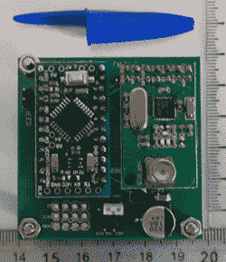

# 轻量级无线协议的开发

> 原文：<https://hackaday.com/2014/06/12/the-development-of-a-lightweight-wireless-protocol/>

【Texane】一直在思考如何从一个遥远的地方监控他的车库门的状态。门本身并不在任何电源插座周围，而且离他公寓里的服务器只有几层楼远。这提出了一些设计挑战，即传感器本身应该与服务器无线连接，低功耗将是一个好主意。这导致了无线通信的[极简框架的开发，该框架允许传感器在不更换电池的情况下运行数周。](http://www.embeddedrelated.com/showarticle/605.php)

无线协议本身基于简单的键值对；每个单独的传感器，与 NRF905 无线电耦合，传递地址、密钥和值。校验和与确认是允许的，[但是正如 PDF 所说的](https://github.com/texane/bano/blob/master/doc/protocol/tex/main.pdf)，这是一个非常简单的协议。

随着软件的退出，[Texane]转向了硬件。微控制器是一个简单的 Arduino 克隆，在一个小板上配有一个无线电和一个硬币电池。微处理器大部分时间处于低功耗状态，传感器(本例中为簧片开关)连接到中断引脚。

不过，这种无线电的功耗有一个问题:当这个 17 字节的短消息传输时，会出现明显的电压下降。这对于充满电的电池来说没问题，但对于部分耗尽的硬币电池来说，掉电的可能性很高。并联的大电容足以抵消这一压降。

对于一体化的家庭自动化和监控系统来说，它仍然有点贵，但开发一个功能性的无线协议和与之配套的硬件是一项不小的壮举。这实际上是一件很棒的装备，[德州人]肯定会找到一些用处。