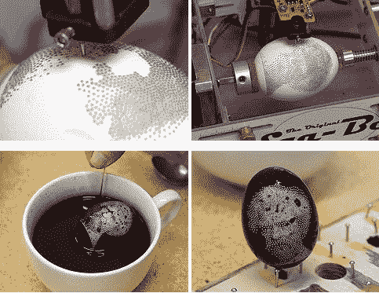
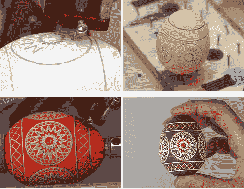

# 鸡蛋机器人有点蜡了

> 原文：<https://hackaday.com/2014/04/15/the-egg-bot-gets-a-little-wax-stabby/>

随着复活节的临近，邪恶疯狂科学家实验室的[温德尔和莲娜]为他们的蛋机器人带来了新的升级。它被称为 [Electro-Kistka](http://www.evilmadscientist.com/2014/electro-kistka/) ，它可以让你的鸡蛋机器人进行抗蜡鸡蛋染色——与乌克兰 [Pysanky 的风格相同。](http://en.wikipedia.org/wiki/Pysanka)

这不是第一次有人把 kistka 绑在鸡蛋机器人上，但是在看到他们的顾客玩得如此开心后，[Windell 和 Lenore]决定自己做一个。它由两个主要部件组成，一个连接到鸡蛋机器人手臂上的加热器组件，和一个电源控制板。为了涂蜡，他们使用 kistka 尖端(看起来像一个有孔的烙铁尖端)，通过毛细作用将熔化的蜡输送到鸡蛋上。

它的工作原理与普通的鸡蛋机器人手臂几乎完全相同，但允许你用非常鲜明的对比给鸡蛋染色，因为蜡完全排斥染料。看看下面这些错综复杂的设计就知道了。

An example of a 4-step multi-color egg using this method

尽管如此，使用 EggBot 似乎有点像作弊。当然，做一大堆超级复杂的鸡蛋，在复活节带着它们去大家庭聚会，并让每个人都相信你是一个鸡蛋装饰大师，会很有趣。