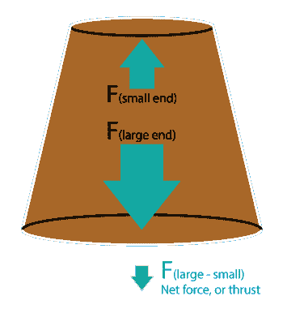
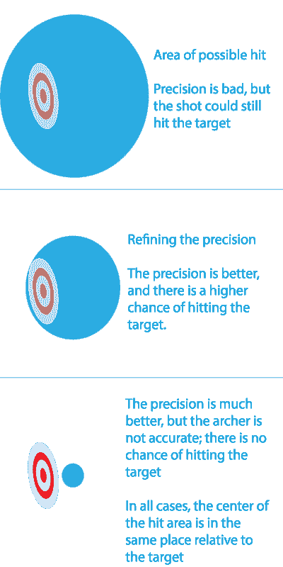

# 电磁驱动可能不起作用，但是如果起作用的话，我们有直升机母舰

> 原文：<https://hackaday.com/2015/08/19/the-em-drive-might-not-work-but-we-get-helicarriers-if-it-does/>

有一种正在测试中的设备有望在有生之年将人类带到另一个星球。它意味着在月球上度假，在土星退休，还有气垫车。如果这是真的，这将是 21 世纪最伟大的发明。如果没有，它将被归入冷聚变惨败之下的可怕科学的历史。这是 EM 驱动，电磁驱动，一种仅依靠射频能量运行的无反应推进器。据说它违反了动量守恒定律，但多个独立的实验室测试表明，它产生推力。真实的故事是什么？这就有点复杂了。

电磁驱动器是一种将射频能量(无线电波)直接转化为推力的设备。这对于宇宙飞船有明显的应用，能够在火星上度假，载人探索土星，并认真考虑人类殖民其他太阳系。EM 驱动器，如果被证明是成功的，将会是有史以来最伟大的发明之一。尽管 EM 驱动器能够实现惊人的创新，但它实际上是一个相当简单的设备，可以用几片铜片构建而成。

EM 驱动器的基本设计是一个截头圆锥体，在工程术语中称为“平截头体”。这个中空的平截头体两端都是密封的。天线或一根简单的电线被放入设备中，大约在平截头体大小两端的中间。该天线连接到射频发生器，大多数情况下是磁控管或其他可以产生微波频率 RF 的设备。

 由于锥台两端的力不同，电磁驱动产生推力。因为平截头体的一端比另一端大，所以净力是圆锥体大小两端的力之差。至于为什么 EM 驱动器能工作的理论解释(如果它真的能工作)，这大概是你能得到的最好的解释了。要理解一些关于电磁驱动如何工作的理论，至少需要一个物理学硕士和多年的射频系统经验。这不是轻松阅读。

虽然 EM 驱动器和类似的 RF 无反应驱动器最近已经成为新闻，但学术文献中的第一次暗示实际上是相对较旧的。被称为 EM 驱动器之父的罗杰·肖耶(Roger Shawyer)在 2000 年代初开始了他目前的研究道路。可以认为电磁驱动诞生的论文是 *[【杨】2008 年发表的【基于量子理论的无推进剂微波推力性能分析】。](http://en.cnki.com.cn/Article_en/CJFDTOTAL-YHXB200805027.htm)* [本文](http://arxiv.org/pdf/1302.5690v3.pdf)由【F.O .米诺蒂】于 2013 年发表，研究了电磁驱动的可能理论背景。直到美国宇航局的先进推进研究小组，也被称为 Eagleworks，[在他们的电磁驱动测试中发现异常](http://arc.aiaa.org/doi/abs/10.2514/6.2014-4029)，媒体才发现了一种仅用电力产生推力的设备的潜力。

### EM 驱动测试和统计

现在有一些实验结果还不确定。然而，他们确实指出了某种效应，最近的测试进一步精确了电磁驱动效应的实际大小。这就是科学家和业余爱好者的区别，也是电磁驱动真实存在的可能性增加的地方，尽管事实可能并非如此。

 为了形象化这种奇怪的统计偏差，想象一下统计学家最喜欢的例子，阿彻。弓箭手的职业或癖好是向目标射箭。在他职业生涯的初期，他不是一个很好的弓箭手，但他确实在用完箭之前设法击中了几次目标。

练习几个月后，弓箭手的准确度提高了。他的箭射不像以前那么远了，也不用走那么远去收箭了。事实上，他甚至更经常击中目标。很明显，他在进步。

再经过几个月的训练，弓箭手似乎一箭也射不中目标。当然，他几乎不需要走路来收集他的箭，他所有的箭都落在同一个平方英尺的地面上。作为中世纪的弓箭手，他的准头惊人，但他就是射不中目标。

对于任何一个有统计学经验的人来说，这就是如何区分*精确度*和*精确度*的方法。准确度是击中目标，精确度是紧密的组合。这种差异意味着当你慢慢提高测量的准确性时，奇怪的事情会发生。

在左图中，三种情况下“击中框”的中心相对于靶心都在完全相同的位置。唯一的区别是精确度的降低使得射手的 T2 不那么精确。

这种效果如果你注意的话，随处可见；2004 年末，小行星阿波菲斯被发现，并被预测有 1/233 的几率在 2029 年与地球相撞。几天后，与地球相撞的概率增加到 37 分之一。直到收集了更多的数据，小行星阿波菲斯对地球的威胁才降低到令人放心的水平；2029 年，这颗小行星将完全错过地球。

在各种 EM 驱动测试的结果中也可以看到这种影响。从中国的实验室测试到美国宇航局的 Eagleworks 的测试，观察到的效果得到了进一步的改善，实验噪声指数的信号增加了。这正是你从任何正在被越来越详细地研究的事物中所期待的，并且这种效应是真实的可能性的增加并不能证明这种效应是真实的。

然而，这并不能阻止人们的梦想。最好的研究指出，电磁驱动器每向平截头体注入 1 千瓦的能量，就能产生 30 千牛顿的推力。更简单地说，1 千瓦(点亮 10 个 100 瓦灯泡或运行微波炉的功率)可以举起 3000 公斤的物体，并在离地面几英尺的地方悬停。

### 举起非常大的东西

 用更实际的话来说，一辆特斯拉跑车有一块 58 千瓦时的电池，重约 1500 公斤。把电磁驱动绑在特斯拉上，你就有了气垫车。气垫车很酷，但是尼米兹号航空母舰 T4 号排水量约 10 万公吨，由两个核反应堆提供动力，总发电量为 208 兆瓦。那是神盾局的直升机母舰。用 EM 驱动器拜访另一个恒星只是一个目标；如果电磁驱动起作用，我们也将会得到现在无法想象的交通工具。

要从实验噪音中梳理出电磁驱动信号，还有很多工作要做。这甚至可能不是真正的效果。然而，多个实验室已经测试了 EM 驱动器的版本，并在他们的数据集中发现了奇怪的效果。就目前的情况来看，EM 驱动器只比一个自称在工作室里有一台永动机的疯子高几个档次。但即使是伽利略也被贴上了异教徒的标签；关键在于证明这个理论。到目前为止，EM 驱动器经受住了考验，如果它被证明是真实的，它将是一项比内燃机更重要的发明。