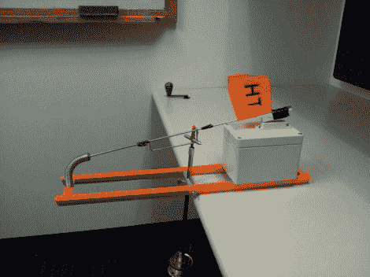

# 世界各地冰上钓鱼的刺激

> 原文：<https://hackaday.com/2012/07/04/the-excitement-of-ice-fishing-now-from-anywhere-in-the-world/>

现在你可以体验几个世纪以来冰钓者的兴奋感了，这要感谢这种蜂窝功能的提示。

对于门外汉来说，一点冰上钓鱼的入门知识可能是合适的。你在上面看到的大部分是一个标准的冰上钓鱼装置。基本上，它让你设置许多诱饵线，只需注意当其中一条线钩住一条鱼时会弹出一面旗帜。只要在冰上钻一个洞，把线放进去——橙色的框架放在冰面上。

这里的附件是隐藏 Xbee 设备的灰色盒子。当旗子放下时，磁铁和簧片开关(可以在当地五金店找到)完成一个电路。但如果标志弹出，簧片开关打开(或关闭，我们不确定是哪一个)，Xbee 会向基站发送警报，然后基站会将其转换为文本消息推送到您的手机。如你所料，休息后有一段视频。

有趣又复杂。但也不是完全没用。我们建议将 Xbee/蜂窝硬件换成便宜的微控制器/蓝牙设置。这样你就可以在冰室里喝几杯冷饮，同时等待无线网络通过 SL4A 脚本向你发出警报。

[https://player.vimeo.com/video/44390012](https://player.vimeo.com/video/44390012)

[通过[使](http://blog.makezine.com/2012/06/28/xbee-enabled-ice-fishing-pole/)