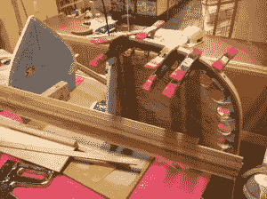
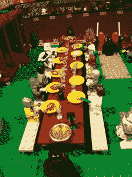

# 第一届奥马哈迷你创客节绝对值得一提

> 原文：<https://hackaday.com/2014/09/17/the-first-annual-omaha-mini-maker-faire-was-definitely-something-to-write-home-about/>

如果你问我，我会说奥马哈的第一届年度迷你创客集会取得了令人振奋的成功。我想奥马哈创客集团的协调员埃里克会欣然同意。该活动在奥马哈儿童博物馆举行，这是一个充满活力和丰富多彩的背景，30 名制造商在现场展示他们的创作。

奥马哈创客团的代表们总共有三个展位。其中一个展示了从他们的空间里出来的各种奇妙的东西，我们将在接下来的帖子里介绍。他们带来了我在《堪萨斯城创客集市》帖子中告诉你的 PiPhone，而且[Foamyguy]发现菜单里藏着一个有旋律的复活节彩蛋。[OMG]还带来了他们的太阳能 EL wire 标志标志，一架四轴飞行器，一个巨大的刷子机器人，一个六足机器人，一个雪茄盒吉他，一个非常有趣的大理石跑道，一个蒸汽朋克芭比，以及他们屡获殊荣的 Power Racing 系列汽车 KITT。是的，你打赌它有一个拉森扫描仪。

在他们的第二个展位上，参观者正在使用 3D 打印的底盘构建自己的常规大小的牙刷机器人。这些都是特别设计来容纳他们带来分享的牙刷头，寻呼机电机和 CR2032s。[OMG]的[Sarah]有她自己的流行摊位，展示她的服装、粘土作品和珠宝。

早些时候，我在[妮可]的名为 Upcycled Art 的摊位前停下来，用汽水罐标签和丝带做了一个手镯。她是当地的一名艺术家，制作纽扣艺术和其他东西。当我在标签上编织缎带并与她交谈时，我的同伴[Foamyguy]正在努力用杂志页制作一个玫瑰花结。

在路的对面，另一位名叫[Kjell]的当地艺术家正在展示蒸汽弯曲技术。[杰尔]用硬木和玻璃纤维制成了三只独木舟、几只桨和一个冲浪板。他搭建了一个小夹具，让孩子们将一块木头粘在最上面的木头上，然后钉在框架上，从而将木头添加到一个小独木舟模型上。

在博物馆的剧院区后面，有几个摊位专门展示可食用的制作。在[汤姆和艾比]的养殖蔬菜店，我品尝了一些美味的自制泡菜，并品尝了两种康普茶，这是一种通过乳酸发酵制成的美味茶饮料。我没吃酸菜，但我确定是。。。美味极了。紧挨着他们的是奥马哈生物燃料合作社，他们提倡将废弃植物油直接或加工成生物柴油后用作燃料。

我被一个托盘吸引到附近的一张桌子上，托盘上摆满了各式各样的眼睛。在和【佩吉】讨论了制作 [Kit-Cat 时钟](https://www.kit-cat.com/)眼睛的可能性后，我意识到她的桌子和旁边的那张桌子有关联，制作它/移动它。孩子们可以在[佩吉]的桌子上做一个东西，然后在另一边的停格装置上用不同的背景制作动画。

剧院的边缘是“紧张的脚”,一个敲击古董木鞋形式的黑客/艺术装置。当有人靠近脚时，它会使用一个 Arduino 和一个螺线管跳舞。

[林肯奥马哈乐高用户组](http://lolugclub.org/)，或【LOLUG】带来了一些非常酷的东西，包括内布拉斯加州议会大厦的模型和两辆乐高火车。不过，我最喜欢的是《我的世界》魔方和星球大战感恩节晚餐的场景。

说到食物，我本应该用自行车发电机把我在食品车上吃的热狗和薯条消耗掉，但那是一个繁忙的景点。我确实用他们的手摇发电机点亮了顶部的一个小灯泡。

一个名叫[Russell]的非常热情的孩子对学习编程赞不绝口，特别称赞 Codeacademy 和 Scratch。他对构建 Minecraft mods 最感兴趣，并向我们展示了他制作的一对门户网站。在一边，他让一个 NXT 机器人不停地画一个看起来像披萨的东西。

我惊喜地看到了我写过的两个黑客，来自[致命工程]的[自制火箭筒](http://hackaday.com/2014/07/18/homemade-bazooka-has-earned-its-stripes/)和[威尔]的[生日礼物抓爪机](http://hackaday.com/2014/01/20/happy-birthday-son-heres-your-very-own-claw-machine/)。[威尔]带来了一台机器，里面装满了小小的橡皮糖和黏糊糊的东西，这两样我都拿不到。然而，很多孩子都很开心地离开了，还有一长串年轻的希望之星。【致命工程】还带来了遥控割草机和吹雪机基地。

我亲自看到了我的第一个巨型 LED 立方体，它真的很酷。同一个人也有一个六足机器人和另一个带 3D 打印麦克纳姆轮子的机器人。他在展示机器人和电子产品的 3D 打印部件。

[https://videopress.com/embed/e8gxO5H5?hd=1&cover=1&loop=0&autoPlay=0&permalink=1&muted=0&controls=1&playsinline=0&useAverageColor=0](https://videopress.com/embed/e8gxO5H5?hd=1&cover=1&loop=0&autoPlay=0&permalink=1&muted=0&controls=1&playsinline=0&useAverageColor=0)