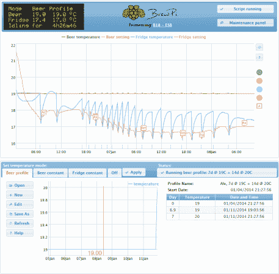

# BrewPi 的冰箱黑客指南

> 原文：<https://hackaday.com/2014/08/03/the-fridge-hacking-guide-by-brewpi/>

BrewPi 背后的团队又开始了！这一次，他们制作了一个在线指南，展示如何将一个迷你冰箱变成一个[树莓派& Arduino 控制的发酵室](http://www.brewpi.com/fridge-hacking-guide/)。在书中，他们描述了三种可能的选择:

*   选择 1:做一根简单的开关电源线，不要侵入冰箱电子设备。
*   选项 2:制作一根可切换的电源线，但也要覆盖或移除恒温器。
*   选择 3:拆掉恒温器，把固态继电器完全整合到你的冰箱里(这就是科恩和埃尔科所做的)。

不过，首先要做的是。他们不得不清理冰箱。根据他们从哪里得到它或者它被拔掉多长时间，它的内部可能会因为霉菌在每个角落生长而变得非常肮脏和恶心。这花了一个小时左右的时间来彻底清洗，以免酿造过程受到外部污染的影响。这一切都是值得的，因为一个控制良好的发酵室会产生一批优质的啤酒。

他们把他们的激光切割盒放在冰箱顶上，拿着一个 LCD、Raspberry Pi、Arduino 和 BrewPi Arduino 盾。Arduino 读取冰箱内的温度传感器、啤酒和环境温度。然后它控制他们添加的 SSR 来切换压缩机和加热器。然后，电缆穿过冰箱并控制压缩机。

[Elco]和[Koen]增加了两个固态继电器:一个将交流电源切换到压缩机并启动继电器，另一个为冰箱内的加热器供电。但是，他们确实需要接触到压缩机并进行一些更改。首先，将增加两个 SSR，其中一个 AC 端子连接到 LIVE(棕色),另一个连接到加热器和压缩机。

然而，无论选择哪种方法，最终产品都将允许任何人监控并轻松控制您的微型啤酒的温度范围，同时能够记录数据并生成网络嵌入的图表，如下所示。它通过使用附加的 Arduino 自动运行温度控制算法来工作，向 Raspberry Pi 报告其 web 界面和数据记录。

