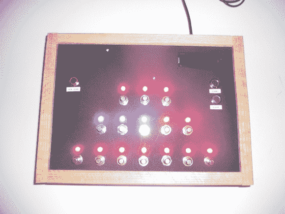

# 尼姆的游戏

> 原文：<https://hackaday.com/2013/11/28/the-game-of-nim/>

[Greg]从高一开始就对 NIM 游戏着迷。最近，他想起了这件事，并决定尝试制作一个用 Visual Basic 编写的人工智能版本来扮演。

如果你不熟悉这个游戏，[它相当简单](http://en.wikipedia.org/wiki/Nim)。每一排灯光代表一种特定类型的物体。玩家每回合从任意一行中拿尽可能多的物品。拥有最后一件物品的玩家输了。

现在，你可以想象，在游戏中编写一个人工智能可能是一个相当具有挑战性的考验。[格雷格的]第一次尝试是使用一种记忆结构来捕捉每一个可能的动作。只有 15 步棋，1 到 7 盏灯，随着游戏的进行，选项会减少，所以…那不会太糟糕，对吗？在运行他新写的代码时，他得到了一个内存不足的错误。不仅仅是任何内存不足的错误，还需要超过 over 的内存！哎呦。

他最终找到了正确的代码，这使得玩游戏成为一种非常有趣的经历。你看，电脑从每个游戏中学习。起初，这就像玩一个年幼的孩子——容易欺骗和殴打。但是随着游戏的进行，电脑会记住他的模式，并且不会再犯同样的错误。他只是忘记了用它玩游戏的次数，但它一直在变得越来越好。向你学习一定很令人满意——有点像为人父母…

无论如何，[Greg]在他的博客上有一篇很棒的文章，所以你一定要去看看——我们只能总结这么多！休息后留下来看看比赛的录像。

[https://www.youtube.com/embed/Ja0sZo5Mols?version=3&rel=1&showsearch=0&showinfo=1&iv_load_policy=1&fs=1&hl=en-US&autohide=2&wmode=transparent](https://www.youtube.com/embed/Ja0sZo5Mols?version=3&rel=1&showsearch=0&showinfo=1&iv_load_policy=1&fs=1&hl=en-US&autohide=2&wmode=transparent)