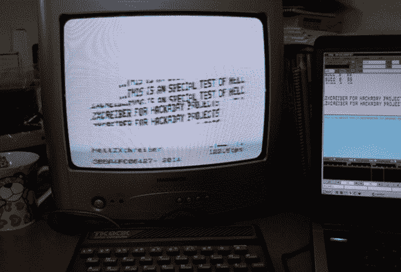

# 地狱之河

> 原文：<https://hackaday.com/2014/04/15/the-hellzxchreiber/>

Hellschreiber(德语中“光笔”的意思)是在 20 世纪 20 年代发展起来的一种传输文本的方式，这种方式比当时的电传打字机更加强大。这些设备在二战中被德国人使用得非常有效，后来在有线服务中流行起来，一直使用到 80 年代。传真机然后发生了，除了几个勇敢的业余无线电爱好者，没有人真正关心 Hellschreiber。

在 90 年代初，一些业余无线电爱好者意识到他们可以使用个人电脑通过这种极其简单的协议进行通信，这种协议对干扰和微弱的无线电链路也非常有弹性。[Danjovic]正跟随他们的脚步，在一个旧的 ZX 频谱克隆上解码 Hellschreiber。

[Danjovic]用在[Hallschreiber wiki 文章](http://en.wikipedia.org/wiki/Hellschreiber)中找到的声音样本和[fl digi](http://www.w1hkj.com/Fldigi.html)生成的一些文本测试了他的代码。一切都工作得很漂亮，an [Dan]甚至可以通过音量控制来改变文本的强度——如果 HellZXchreiber 进入现场，这将是一个非常有用的功能。

源和图像文件可供所有你奇怪的特殊爱好者。其他人可以看看下面的视频。

[https://www.youtube.com/embed/Hac6NiUl4TY?version=3&rel=1&showsearch=0&showinfo=1&iv_load_policy=1&fs=1&hl=en-US&autohide=2&wmode=transparent](https://www.youtube.com/embed/Hac6NiUl4TY?version=3&rel=1&showsearch=0&showinfo=1&iv_load_policy=1&fs=1&hl=en-US&autohide=2&wmode=transparent)