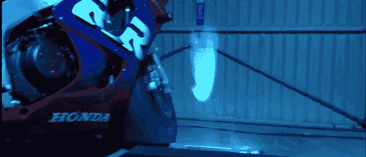

# 盘旋的全息星球大战显示器

> 原文：<https://hackaday.com/2014/06/06/the-hovering-holographic-star-wars-display/>

虽然我们距离《星球大战》的远程呈现全息显示器还有很长的路要走，但项目网站上的这个建筑是我们迄今为止看到的最接近的了。更好的是，它可以建在车库里，花不了多少钱。

气垫车内有几个风扇和一对超声波雾化器，可以将水变成极细的水雾。风扇通过显示器的底部和简单的吸管将蒸汽吸上来，形成一层水蒸气。把一个投影仪放在这薄薄的一层蒸汽后面，你就有了一个看起来漂浮在半空中的显示器。

只需将几个单元放在一条线上，显示器的底座就可以放大。它仍然只是一个原型——未来的版本将提高稳定性并减少雾层的厚度——但对于定制的全息显示器来说，它仍然是一个非常酷的构建。

[https://www.youtube.com/embed/UrcVB3sOgHU?version=3&rel=1&showsearch=0&showinfo=1&iv_load_policy=1&fs=1&hl=en-US&autohide=2&wmode=transparent](https://www.youtube.com/embed/UrcVB3sOgHU?version=3&rel=1&showsearch=0&showinfo=1&iv_load_policy=1&fs=1&hl=en-US&autohide=2&wmode=transparent)

顺便说一句，是的，我们知道这不是全息图。仍然欢迎你在评论中指出语言变化的事实。