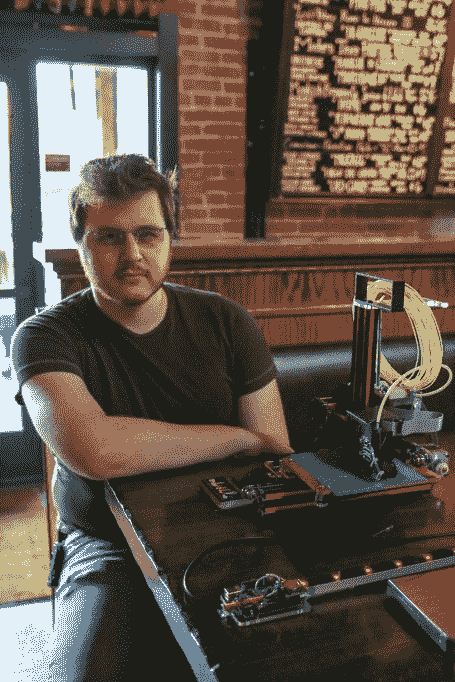
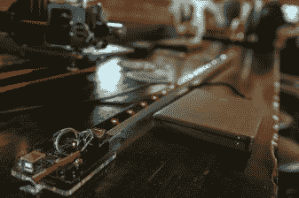
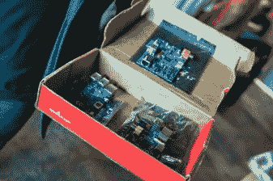
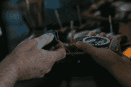
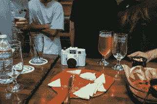
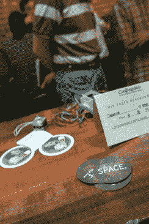
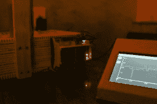

# 首届 Hackaday.io 聚会

> 原文：<https://hackaday.com/2014/08/27/the-inaugural-hackaday-io-meetup/>

上周一，我们在加州帕萨迪纳的聚会酒吧举行了第一次黑客日项目聚会。我们知道这个地区有很多 [Hackaday.io](http://hackaday.io) 成员，并认为聚会是他们互相见面的好机会。

结果出乎意料的好，有各种各样的制造商和黑客。我遇到的人包括航空工程师、嵌入式设备开发人员、3d 打印机发明者和网络开发人员。大约 30 名 Hackaday 读者和一些新手一起出现了，随后是几个小时的快乐时光，他们喝着啤酒，交流故事，戳着闪闪发光的东西，欣赏着 3d 打印机。

      

来自 ToyBuilderLabs 的 Joseph Chiu 带来了一些我们很多人都见过的最大的单块 3d 打印品。 [Deezmaker](http://deezmaker.com/ "Deezmaker") 的工作人员也来了，展示了他们的 Bukito 便携版最受欢迎的派对戏法——上下颠倒打印！展示了基于 ChipKit 的超声波乒乓球悬浮机。[Liam Kennedy]展示了他的连接到 LED 环的[is saover](http://issabove.com/)系统，我们甚至有幸看到了由[Ron Evans]制作的美国第一个原型树莓 Pi，他是[GoBot](http://gobot.io)和[cylon js](http://cylonjs.com)的创始人之一。更多的图片和一些额外的活动摘要可以在下面找到。

总之，我们度过了一段美好的时光，这将成为帕萨迪纳地区一个月一次的常规活动。

#### 举办自己的黑客日项目会议

但这不仅仅局限于南加州。如果你想在当地组织一次 Hackaday.io 聚会，请[通过 meetups@hackaday.com](mailto:meetups@hackaday.com)告诉我们，我们会确保给你一个机会让你开始。认识更多来自 Hackaday 社区的人真的很棒，我们已经看到一些合作开始出现。

                                                           