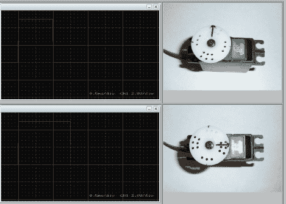

# 伺服电机的内部工作原理

> 原文：<https://hackaday.com/2012/10/18/the-inner-workings-of-servo-motors/>

伺服系统似乎是在业余爱好项目中添加马达时的首选。它们很容易被破解，用于机器人的连续旋转，但由于控制板完好无损，它们对于基于位置的应用相当精确。但是你知道硬件实际上是如何工作的吗？【Rue Mohr】最近发表了[一篇文章，看伺服电机](http://eds.dyndns.org/~ircjunk/tutorials/elex/hobbyservo/servo101.html)的内心世界。

众所周知，这些电机使用电压、接地和信号连接进行控制。喇叭的位置(上面伺服系统上看到的轮子)取决于控制信号。20 ms 脉冲的占空比决定了这一点。外壳内部是一个能够测量该信号的控制板。它有一个芯片来监控传入的 PWM 脉冲，但这只是等式的一半。该控制器还需要来自喇叭的反馈，以了解其位置是否正确或需要改变。连接电机和喇叭的齿轮箱集成了一个电位计。它的电阻随着喇叭的转动而变化。知道了这一点，就可以通过改变电阻测量来微调伺服系统。