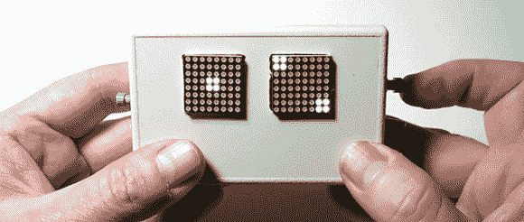

# 迄今为止最随机的电子骰子

> 原文：<https://hackaday.com/2014/05/24/the-most-random-electronic-dice-yet/>

如果你已经写了一个很棒的库来用微控制器生成随机数，你会做的第一件事是什么？[造一对电子骰子，当然是](https://sites.google.com/site/astudyofentropy/project-definition/timer-jitter-entropy-sources/entropy-library/led-matrix-dice)。

[Walter]为 AVR 创建了熵库,作为真随机数的可靠来源。它的工作原理是利用看门狗定时器的自然抖动；无论如何都不算快，但无论如何，大多数熵源都没那么快。通过对大量 AVR 芯片进行抽样和一些统计测试，结果表明这个库[实际上是一个很好的随机性来源](https://docs.google.com/spreadsheet/pub?key=0AukiKiYKrSl9dHNIX19oZ0ZqNDc1RDNMa042SzhZT0E&gid=0)，至少和一对骰子一样好。

电路本身使用 Adafruit 的两个 8×8 LED 矩阵、一个 Arduino 和一对按钮。支持的模式有 2d6、2d4、2d8、2d10、1d12、1d20、一副牌、单个十六进制数、单个 8 位二进制数或八个字符的字母数字密码。这对 D&D 来说绰绰有余，或者当你真的需要一个无法设置的密码时。下面是视频演示。

[https://www.youtube.com/embed/S5YeHWBv0AU?version=3&rel=1&showsearch=0&showinfo=1&iv_load_policy=1&fs=1&hl=en-US&autohide=2&wmode=transparent](https://www.youtube.com/embed/S5YeHWBv0AU?version=3&rel=1&showsearch=0&showinfo=1&iv_load_policy=1&fs=1&hl=en-US&autohide=2&wmode=transparent)