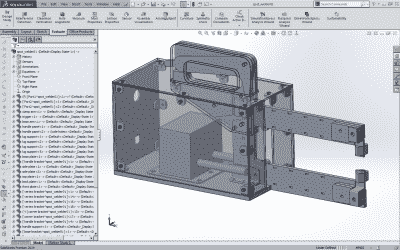

# 我们见过的最好的自制点焊机

> 原文：<https://hackaday.com/2015/07/05/the-nicest-home-made-spot-welder-weve-ever-seen/>

天哪，看看这台*国产* [点焊机的制造质量。](http://har.ms/blog/scrap-microwave-spot-welder)

几乎这里的每个人都知道，使用重新包装的微波变压器来制造这些东西[是完全可能的，但它们通常是由木头](http://hackaday.com/2014/07/21/spot-welder-dont-buy-it-build-it/)制成的[，就像我们周五交换的](http://hackaday.com/2009/06/23/how-to-build-your-own-spot-welder/)，我们经常想知道除了“嘿，看，我造了一个点焊机！”。我自己做了一个，但是后来买了一个专业的，因为效果更好。虽然不是(马修·博加蒂)，他的看起来更好，甚至比我买的那个有更多的功能！

为什么？因为他对他的设计进行了认真的思考。他甚至在 SolidWorks 中对整个东西进行了 3D 建模。

除了出色的激光切割外壳(配有棘轮工件夹紧功能)，[Matt's]还增加了一个 Arduino 来创建计时电路。大多数时候，你只需捏紧夹子，按下按钮，看着金属变热——“我觉得这样很好……”

但是有了实际的计时电路，你可以[计算出相对于电流和电极尺寸，你需要多少时间](http://www.robot-welding.com/Welding_parameters.htm)来产生高质量的焊接。

现在他只需要一个测力计！

[https://www.youtube.com/embed/450S4mBNAM8?version=3&rel=1&showsearch=0&showinfo=1&iv_load_policy=1&fs=1&hl=en-US&autohide=2&wmode=transparent](https://www.youtube.com/embed/450S4mBNAM8?version=3&rel=1&showsearch=0&showinfo=1&iv_load_policy=1&fs=1&hl=en-US&autohide=2&wmode=transparent)

【感谢 Cibomahto！]