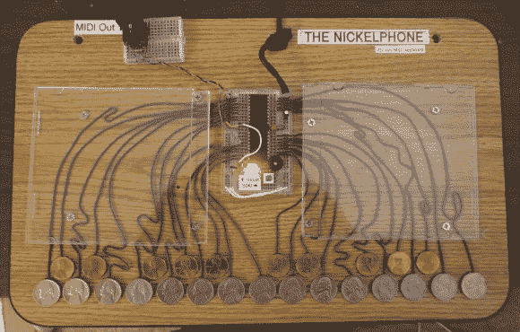

# 镍币电话

> 原文：<https://hackaday.com/2013/10/28/the-nickelphone/>

[Tyler Bletsch]给我们发了一个关于他新作品的提示:[一个重新定义了“投币式”的键盘](http://discspace.org/nickelphone/)Nickelphone 可以通过压电蜂鸣器发出方波音调，但【Tyler】将这款 25 键钢琴制作成能够驱动完整合成器的 MIDI 键盘。

他选择了 ATMega644 作为大脑，因为它对 Arduino 友好，但比通常的 ATMega328 芯片有更多的数据引脚(32 个)，这使他可以为每个按键提供自己的 pin。每个硬币都焊接到自己的导线上，并连接到一个 1mω的电阻阵列。硬币按压是通过简单的电容传感技术[识别的，这里概述了](http://playground.arduino.cc/Code/CapacitiveSensor)，但是【Tyler】需要利用一种变通方法来准确检测多次按压。

查看[Tyler 的]详细项目指南，了解更多信息以及源代码。休息之后，看看 Nickelphone 的视频，然后浏览其他一些电容触摸黑客，如[电容触摸名片](http://hackaday.com/2012/11/04/capacitive-touch-business-card/)或[电容触摸游戏控制器](http://hackaday.com/2012/08/08/making-a-game-with-capacitive-touch/)。

[https://www.youtube.com/embed/DXPymiiYudA?version=3&rel=1&showsearch=0&showinfo=1&iv_load_policy=1&fs=1&hl=en-US&autohide=2&wmode=transparent](https://www.youtube.com/embed/DXPymiiYudA?version=3&rel=1&showsearch=0&showinfo=1&iv_load_policy=1&fs=1&hl=en-US&autohide=2&wmode=transparent)