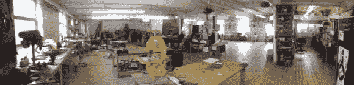

# 诺丁汉黑客空间

> 原文：<https://hackaday.com/2013/02/17/the-nottingham-hackspace/>

黑客空间(在这种情况下称为 hackspace)有各种形状和大小，从刚刚起步的，到一些装备令人印象深刻的。[Dominic]来信告诉我们关于诺丁汉 hack space 的情况，它完全属于第二类。我们会邀请你在休息后看看他们的介绍视频，但你要做好准备，希望你住在他们附近。

如果你碰巧住在那里，除了一个精美的网站和介绍视频，他们还有将近 4500 平方英尺的空间。自然，他们有现在无处不在的 3D 打印机，但他们也有一系列令人印象深刻的更传统的以及计算机控制的工具。这些设备包括车床、焊接机、CNC 路由器、激光切割机，甚至基本的 PCB 制造设备。成员项目和自行车的存储空间也包括在内。

所以一定要去看看。他们现在有大约 130 名成员，但是自然很乐意在那里见到你！ [https://www.youtube.com/embed/TrX7EQfvutA?version=3&rel=1&showsearch=0&showinfo=1&iv_load_policy=1&fs=1&hl=en-US&autohide=2&wmode=transparent&listType=playlist&list=UUCn0IFJtZp5GbrHljwKoyyw](https://www.youtube.com/embed/TrX7EQfvutA?version=3&rel=1&showsearch=0&showinfo=1&iv_load_policy=1&fs=1&hl=en-US&autohide=2&wmode=transparent&listType=playlist&list=UUCn0IFJtZp5GbrHljwKoyyw)