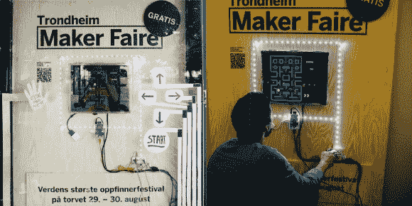

# Pac-Man 巴士站是游戏玩家的天堂

> 原文：<https://hackaday.com/2014/08/29/the-pac-man-bus-stop-for-gamers-at-heart/>

等公共汽车可能会被拖走。你永远不知道它会在什么时候到来，总是望着马路，希望能在它转弯的时候看到它。当它没有立即显示出来时，结果通常是盯着一部“智能”手机检查它是否有任何收到的信息。向上引导注意力可能会产生一个估计到达时间的列表，甚至可能是一张显示全天路线的地图。但是据我们所知，全世界只有一个公共汽车站，在那里人们可以一边等公共汽车来，一边玩吃豆人游戏。

它是由镇上两个创客社区共同努力创造的。挪威创意公司和特隆赫姆制造商合作建造了一个互动游戏显示器，让人们能够通过引导著名的视频游戏角色绕过蓝色迷宫、吃黄色小球和沿途躲避彩色幽灵来打发时间。这次展览也是为了提高那年即将到来的[特隆赫姆创客节](http://www.trondheimmakerfaire.no/en/)的知名度。他们选择 Pac-Man 作为基础，并将一个名为 [Makey Makey](http://www.makeymakey.com/) 的稍加修改的发明套件与一个运行 [RetroPie](http://blog.petrockblock.com/retropie/) 的树莓派集成到公交车站的实际框架中。为了获得批准，相关人员必须有一些重要的业务关系。他们象征性地侵入了公交车站的电网，获得了为定制游戏单元供电所需的 230 伏电压。一旦连接上，任何站在旁边的人都可以玩吃豆人，直到公共汽车来了。挪威创作公司的[Ragnar]在一封电子邮件中告诉我们，他们未来的想法包括同步几个可以相互通信的站点，这可能会导致一些伟大的多人互动。他们还上传了一个精彩的视频，展示了他们当前设计的建造过程。请查看以下内容，并让我们知道您希望在附近的公交车站看到哪些其他类型的游戏。

[https://player.vimeo.com/video/104494655](https://player.vimeo.com/video/104494655)