# 派对开始了，然后火龙出现了

> 原文：<https://hackaday.com/2014/07/16/the-party-was-bumping-then-the-fire-dragon-showed-up/>

史诗派对。

我不会轻易使用这个标签。红牛创造的展示和讲述日结束后——获胜者被授予奖杯，并在 [Bert 的](http://www.bertsentertainmentcomplex.com/)餐厅被塞满烤肉——人们开始三三两两地来到 OmniCorp 底特律参加派对。

像所有最好的派对一样，我们真的没想到会这样。我手里拿着一瓶啤酒，在前面的街道上抓了一把折叠椅，和各种各样有趣的人聊天。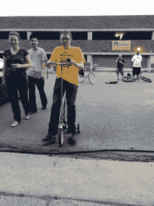[Brian]他骑着一辆改装过的儿童三轮车，这证明了他的未来仍然是可行的。他们用绳子将该区域隔开，并为 DJ 设置了巨大的扬声器。然后两个家伙在街上玩游戏，分担拖运装满冰和 12 盎司透明玻璃瓶的工作。原来他们刚刚在街上开了一家酒厂，并决定为庆祝活动捐赠一些伏特加浸剂。好吃！

在楼上，一个几百平方英尺的区域被一个酒吧(有各种各样的小桶、冰镇饮料和一个热狗滚轴)、沙发、几个工作台、第二个 DJ 摊位和一个照相亭包围着。在烟雾机降低能见度之前我们只拍到一张照片。

不像我参加过的很多聚会，和任何人开始交谈都很容易。底特律的生活费用很低，艺术家们纷纷涌向这个地区。这是这个小组的主要成员。迷人的人，他们正在从事各种不同的项目，有在他们的街道上建设社区的故事，同时修复花费 1-25000 美元购买的房子，但没有你认为房子应该有的大部分东西。

> 然后火龙出现了

[https://www.youtube.com/embed/1RsUp5cSc6Y?version=3&rel=1&showsearch=0&showinfo=1&iv_load_policy=1&fs=1&hl=en-US&autohide=2&wmode=transparent](https://www.youtube.com/embed/1RsUp5cSc6Y?version=3&rel=1&showsearch=0&showinfo=1&iv_load_policy=1&fs=1&hl=en-US&autohide=2&wmode=transparent)

里面挤满了人，外面开始变得拥挤。然后火龙出现了。取名为 [Gon KiRin](https://www.facebook.com/gonkirin) ，是[泰迪·罗](https://www.facebook.com/teddyloyeungman/info)和【瑞安·c·道尔】的合作，他是底特律团队的成员，也是 [Recycle Here 的常驻艺术家！](http://www.recyclehere.net/)，红牛创作的搭建场地。这头怪兽是在一辆 20 世纪 60 年代的翻斗车的框架上建造的，大部分建筑材料都是在高速公路的两侧找到的。背面巨大的丙烷罐让它可以喷火。我喜欢三个菊花链 9 伏和两个裸线的控制机制。一件事变得显而易见；你不能在 Gon KiRin 喷火的时候站在它面前。

人群挤到尾部顶部和臀部后部的沙发上。龙的背部也有一组不断旋转的人。午夜过后，客人真的开始蜂拥而至。[凯勒]我试图关闭党，但几个小时后的午夜，它似乎没有得到任何缓慢。

像这样结束周末真的证明了你需要让你的团队进入明年的红牛创造赛。我找到了一个简单的方法——法官们不必 72 小时不睡觉来做东西。尽管参赛者被剥夺了睡眠，但我没有遇到任何人在建造过程中不开心，不偷懒，或者在派对开始时试图保持清醒。

太棒了，底特律，你现在在我的最佳派对城镇名单上了。还有谁想加入那个名单？Hackaday 几周后会去拉斯维加斯参加 DEFCON。有人知道那个周末计划的聚会吗？我们怎么进去？

 [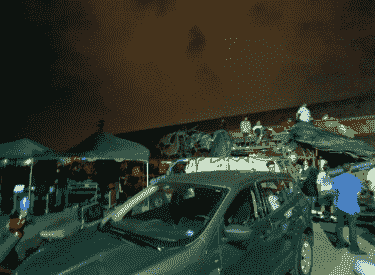](https://hackaday.com/2014/07/16/the-party-was-bumping-then-the-fire-dragon-showed-up/20140712_222633_778/) The fire-breather “Gon KiRin”  We only got one picture before the fog machine was turned on [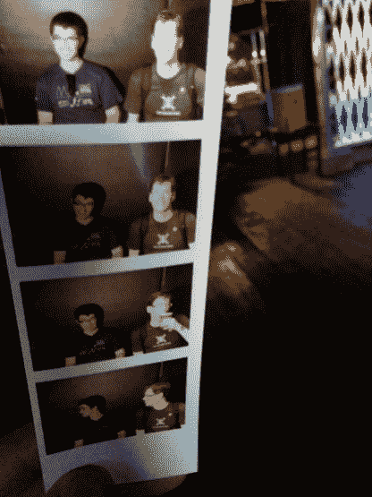](https://hackaday.com/2014/07/16/the-party-was-bumping-then-the-fire-dragon-showed-up/img_20140712_200802/) Chris and Mike tried out the Omnicorp Photobooth which prints out your photos [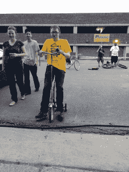](https://hackaday.com/2014/07/16/the-party-was-bumping-then-the-fire-dragon-showed-up/img_20140712_201405/) Brian Benchoff trys out the team choice trophy — a modified toddler’s tricycle [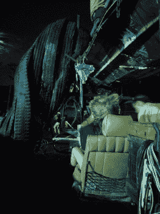](https://hackaday.com/2014/07/16/the-party-was-bumping-then-the-fire-dragon-showed-up/img_20140712_231840/) Behind the driver just before a fireball [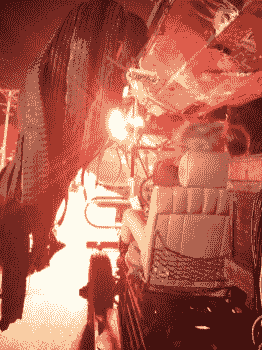](https://hackaday.com/2014/07/16/the-party-was-bumping-then-the-fire-dragon-showed-up/img_20140712_231848/) Behind the driver during a fireball [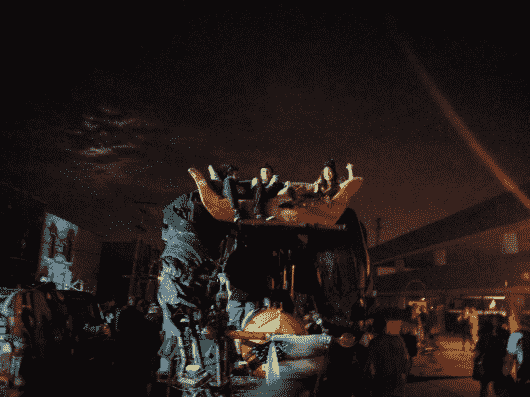](https://hackaday.com/2014/07/16/the-party-was-bumping-then-the-fire-dragon-showed-up/img_20140712_232127/) Couch on the back above the propane tank [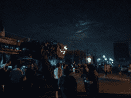](https://hackaday.com/2014/07/16/the-party-was-bumping-then-the-fire-dragon-showed-up/img_20140712_232141/) Getting ready to breathe fire [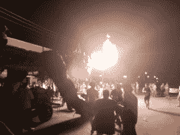](https://hackaday.com/2014/07/16/the-party-was-bumping-then-the-fire-dragon-showed-up/img_20140712_232144/) The peasants scatter amidst the wrath [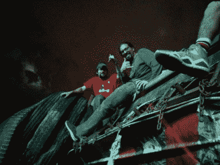](https://hackaday.com/2014/07/16/the-party-was-bumping-then-the-fire-dragon-showed-up/img_20140713_000742/) Greg Needel and Caleb Craft riding the dragon [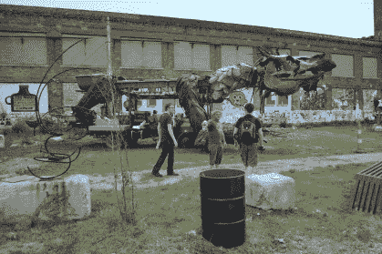](https://hackaday.com/2014/07/16/the-party-was-bumping-then-the-fire-dragon-showed-up/dsc_0118-2/) Daylight view of Gon KiRin [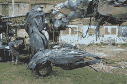](https://hackaday.com/2014/07/16/the-party-was-bumping-then-the-fire-dragon-showed-up/dsc_0120/) Arms are covered in tire treads [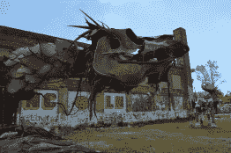](https://hackaday.com/2014/07/16/the-party-was-bumping-then-the-fire-dragon-showed-up/dsc_0121/)  [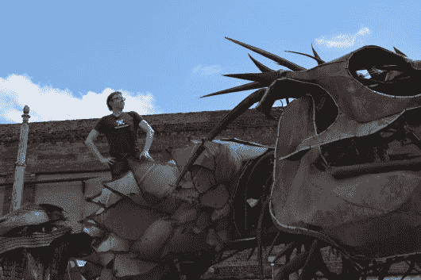](https://hackaday.com/2014/07/16/the-party-was-bumping-then-the-fire-dragon-showed-up/dsc_0124/) Brian training his dragon