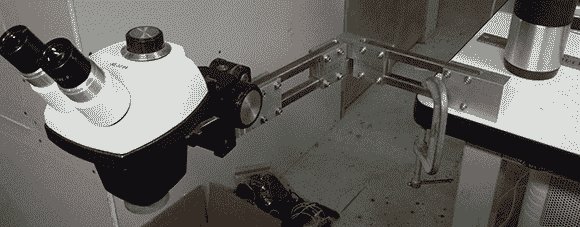

# 购买不带支架的立体显微镜的风险

> 原文：<https://hackaday.com/2013/02/20/the-perils-of-buying-a-stereo-microscope-without-a-stand/>

[Steve]多年来一直希望在他的实验室里有一台立体显微镜。由于他的视力越来越差，他想是时候去易趣上逛逛，看看能发现什么。他最终买了一个非常便宜的没有支架的显微镜，认为他可以很容易地制造一个。嗯，[铰接支架很容易组装起来](http://www.tangentaudio.com/?p=765)，但它确实花了很多时间来建造。

[史蒂夫]项目的主要目标是将他的显微镜放在一个铰接臂的末端。有了这个装置，他可以很容易地在不使用的时候把望远镜藏在工作台的后面，并且在需要的时候可以很容易地把它拿出来。然而，这意味着制造一个定制的手臂，在制造过程中[史蒂夫]几乎使用了他所拥有的所有机床。

最终的结果是一个完全铰接的手臂，可以移动到他工作台上的任何一点，并为那些真正奇怪的项目上下调整。[Steve]说这可能是对家庭粉末涂料的一个很好的介绍，他真的应该建立一个小型 LED 光源，但我们目前为止很喜欢这个项目。

[https://www.youtube.com/embed/TvZXjUfDOlQ?version=3&rel=1&showsearch=0&showinfo=1&iv_load_policy=1&fs=1&hl=en-US&autohide=2&wmode=transparent](https://www.youtube.com/embed/TvZXjUfDOlQ?version=3&rel=1&showsearch=0&showinfo=1&iv_load_policy=1&fs=1&hl=en-US&autohide=2&wmode=transparent)