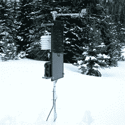

# Phidgets 太阳能气象站

> 原文：<https://hackaday.com/2014/05/11/the-phidgets-solar-powered-weather-station/>

是的，这是一个气象站，它记录来自一套传感器的数据，以一种紧凑而稳健的方式记录大气条件。我们见过一些围绕 Raspberry Pis 和 Arduinos 构建的，但没有一个是用 Phidget SBC 构建的，也很少有一个在天气记录站上花了这么多心思。

这个气象站被设计成自主的，记录数据一周左右，直到包含所有数据的 USB 拇指驱动器被带回实验室并替换为新的。它被设计成在偏僻的地方运行，这意味着没有电力。它是太阳能的，但是你需要多大的太阳能电池板？

要回答这个问题，必须仔细计算整个空间站和电池的功率预算、电池的大小以及云层和低光照条件下的最坏情况。选择无定形太阳能电池是因为它能够从低光源和间接光源产生电能。这是连接到一个 12 伏，110 安培小时的电池。又重又贵，但是矫枉过正总比不能胜任好。

传感器，包括温度、湿度和一个红外温度传感器被连接到一个 T2 探测器上，编码开始了。数据被记录在插在 Phidgets 板上的 USB 拇指驱动器上，该站每周被访问一次以检索数据。这是一个远比解决无线网络解决方案简单得多的解决方案，而且在电力预算方面也更好。

Via [嵌入式实验室](http://embedded-lab.com/blog/?p=8671)