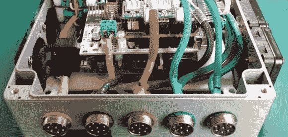

# Pi 数控控制器

> 原文：<https://hackaday.com/2014/05/23/the-pi-cnc-controller/>

在过去的日子里，最新和最伟大的数控机床的框架上栓有微型计算机，配有纸带阅读机和七段显示器。对于今天的家庭数控机械师来说，这些笨重的电子大脑被更现代的东西所取代——带有并行端口的台式计算机。拥有一个装满计算机和电机驱动器的盒子实在是太酷了，而这个小小的树莓数控控制器非常符合这个要求。

控制器使用树莓 Pi 作为设备的大脑，但在 Pi 领域没有太多的步进电机控制选项。然而，有几十个数控盾牌或 Arduino。[Pi AlaMode](http://wyolum.com/projects/alamode/)板能够在 CNC 屏蔽和 Pi 之间提供电压电平转换，还具有电池供电实时时钟的好处。

通过一些适当的连接器、发光按钮和漂亮的电缆套管工作，这种 Pi CNC 控制器将非常适合我们不时看到的任何桌面 CNC 或雕刻构建。