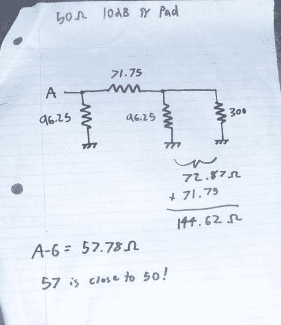

# 圆周率板

> 原文：<https://hackaday.com/2012/05/20/the-pi-pad/>

在电子世界里，我们有阻抗；所有阻碍电流流动的力的总和。通常我们有不同阻抗的电路，50 欧姆用于射频，75 欧姆用于有线电视。在这些电路中使用正确的同轴电缆非常重要，否则你会奇怪为什么你的 RG-58 天线馈线没有给你任何好看的东西。

连接不同电路时，阻抗匹配非常重要。除了明显的缺陷，如 50 欧姆的负载炸毁了 300 欧姆的放大器，还有更微妙的事情，如信号反射和破坏性干扰，这可能足以破坏你正在玩的东西。射频 mosfets 不便宜！但是我们如何匹配阻抗呢？嗯，我们总是可以使用变压器，但那些相当昂贵和笨重。如果我们只有一盒电阻可以玩呢？嗯，我们可以做一个衰减器！你们大多数人可能知道衰减器是什么；如果不是，那就是去放大器。简单地说，这是一个降低信号强度的电路。在 RF 领域，这些通常被称为“焊盘”，最常用的焊盘是 pi 焊盘。通过查看网络的示意图，它变得相当明显，为什么我们这样称呼它。

它看起来像一个π。

现在，我们的客户希望 50 欧姆信号衰减为 3dBm，即 50%。让我们为我们的圆周率挑选一些配料，好吗？

当 Z=50 时，R1 和 R3 相等…

[292.4 欧姆]。

现在 R2 等于…

[17.61 欧姆]

那是一种痛苦。幸运的是，这里有一个小抄。

现在我们有了自己的值，假设负载为 50 欧姆，一切都应该正常工作。但是等等！有人搞砸了，把 300 欧姆的馈线放在了垫子的末端！废话。我们现在来看看网络的电阻值，从 A 到地。我假设你应该知道如何计算电阻…

…105.7 欧姆。这几乎是 50 欧姆输入阻抗的两倍，并将对其他电路造成严重影响。当然，它的工作是减少信号 3dBm，但仍然。

现在有一件有趣的事情。让我们选择一些新的电阻值，以便衰减 10dBm，即大约 90%。根据我们的备忘单，我们需要 71.75 欧姆的衰减电阻和 96.25 欧姆的接地电阻。现在阻抗不匹配是什么情况？

57.78 欧姆，或者说离 50 欧姆有 7.78 欧姆。这比以前好多了，实际上应该可以用作阻抗匹配网络。当然，您会损失 10dBm 或大约 90%的信号强度，但这并不是说不能通过将 C 类放大器与衰减器串联来补偿。即使使用有源元件，它仍然比变压器更便宜、更小。我这里要证明的是，pi 垫可以作为穷人的阻抗匹配器；随着衰减上升，阻抗失配下降。

阻性 pi 焊盘的好处在于它们是超宽带的；由于没有电抗元件，该网络将始终衰减 10dBm，并始终匹配 7.2 欧姆的阻抗。电感网络(如变压器)可能无法同时在 200kHz 和 200MHz 下工作。其实肯定不行！容性网络也有同样的局限性。

LESSON>