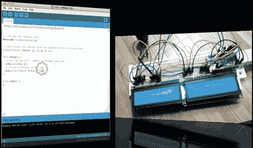
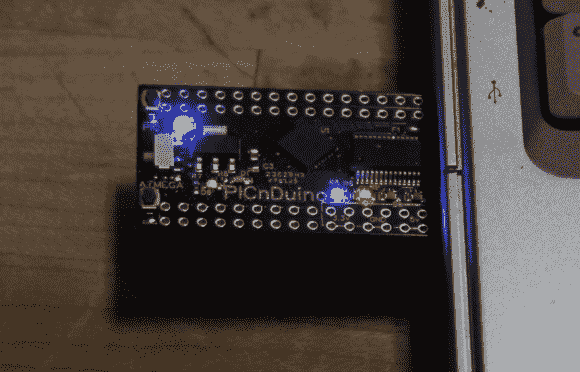

# 皮肯杜伊诺评论

> 原文：<https://hackaday.com/2013/01/10/the-picnduino-review/>

对于那些无法在购买 Arduino 和 PIC 处理器之间做出决定的人，[Brad]提出了一个新颖的解决方案，[PICnDuino。](http://www.bradsprojects.com/electronics/Bradsprojects-PICnDuino.html "PICnDuino")我们之前已经介绍过他的[【retro ball】项目](http://hackaday.com/2012/09/19/retroball-or-super-pong-table-grows-up/ "Retroball Kickstarter project")，但是这次 Brad 已经在 Kickstarter 上获得了全额资助，并且正在预售将于 3 月份交付的主板。

[HAD]，特别是我，很幸运地被送到其中一个委员会进行早期试用。我以前用过 Arduino，但从未用过 PIC 处理器，所以请继续阅读，看看它是否真的像教程视频(在文章末尾)让你相信的那样简单。

我收到了一块写满了字的黑板，还有几块不同颜色的空白板，如下图。松散地连接接头后，我发现底部的振荡器使电路板在放入试验板时有点翘起。这实际上是一个聪明的设计特点，使坐起来一点，允许 USB 连接，而试验板。在快速的身体检查之后，真正的诀窍是看它是否像广告中说的那样起作用。

对我来说，第一个挑战是，根据文档，该板运行在 Windows 或虚拟化环境中。我通常运行 Ubuntu，所以，拿起我妻子大约 2000 年的老式 XP 笔记本，我下载了 Amicus 和 Arduino 软件，如视频教程中所解释的。该教程真正阐明了如何让软件运行。这对于一个完全的初学者来说是非常棒的，而且这样我就不用到处去找软件了。

我在连接主板时遇到的唯一问题是？我不得不手动安装 Amicus18 USB 驱动程序。当谈到 PIC 处理器时，我是一个完全的新手，并且对 Arduino 只有有限的经验，但是一旦驱动程序被更新，一切都变得很容易。

在用它作为 Arduino 编程了一个“眨眼”的草图后，我打开了一个开关，打开了 Amicus IDE。编程 PIC 也很简单，尽管我必须使用并修改一个名为“LED_Flash”的程序来匹配视频，而不是教程中描述的“blink”程序。当 PIC 被编程时，看到 Arduino 的内置闪烁灯仍然工作，以及两个内置灯在同时运行时稍微偏移，这有点奇怪。

对于一款直到 2013 年 3 月才会上市的产品来说，这份文档已经做得非常好了。我真的很高兴能更多地使用它，我认为它将是人们同时运行两个处理器，或者只是选择学习对 PIC 和(n) Arduino 进行编程的一个很好的工具。[请点击这里](http://www.bradsprojects.com/electronics/Bradsprojects-PICnDuino.html "PICnDuino")，直接从澳大利亚运往世界各地！

[https://www.youtube.com/embed/--JmATApB2A?version=3&rel=0&showsearch=0&showinfo=1&iv_load_policy=1&fs=1&hl=en-US&autohide=2&wmode=transparent](https://www.youtube.com/embed/--JmATApB2A?version=3&rel=0&showsearch=0&showinfo=1&iv_load_policy=1&fs=1&hl=en-US&autohide=2&wmode=transparent)

旁注，加分如果你能从两张图看出我这次复习用的是什么电脑！