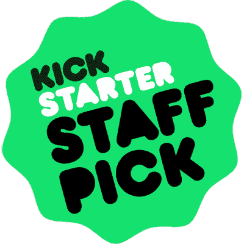

# Kickstarter 的问题是:缺乏透明度

> 原文：<https://hackaday.com/2015/08/25/the-problem-with-kickstarter-a-lack-of-transparency/>

自 2010 年以来，超过 15 亿美元已经从 Kickstarter 的支持者转移到项目创造者手中，Kickstarter 对每一美元收取 5%的佣金，这意味着 Kickstarter 在过去五年中获得了大约 7500 万至 8000 万美元的收入。无论从哪方面来看，这都是一个成功，对于这笔巨额资金，人们肯定会对 Kickstarter 的透明度提出质疑。

这不是一个关于一个不可能的项目的 Kickstarter 项目的帖子，一个打破物理定律的项目，或者一个超出所有合理预期的项目。这是一个关于 Kickstarter 本身的帖子，已经很久了。在过去，Kickstarter 通过取消明显是白色标签商品的重新命名的项目，至少表现出了一些透明度——这直接违反了他们的规则。Kickstarter 甚至取消了违反物理定律的项目，[像这个无线充电蓝牙标签](http://hackaday.com/2014/06/26/the-ifind-kickstarter-campaign-was-just-suspended/)。这只是一个开始，但 Kickstarter 还有一个更大的问题:员工选择问题。

员工选择徽章是一个强有力的工具，可以确保项目达到目标。Kickstarter 使用的排序算法考虑了项目的员工选择状态。如果 Kickstarter 的员工喜欢一个项目，它肯定会吸引更多的眼球，人们会想象会有更多的资金投入到这个项目中。

### 工作人员挑选“制造”活动

这个工作人员 Pick 徽章这么厉害，其实可以决定一个众筹活动的成败。沃顿商学院(Wharton Business School)的 Ethan Mollic 是世界领先的众筹研究人员之一，他发现由 Kickstarter 员工选择的 Kickstarter 活动有 89%的成功机会。如果没有员工选择状态，成功率会下降到 30%。这并不是说员工挑选项目状态*导致*项目成功；Kickstarter 的员工可能非常擅长挑选赢家。然而，它确实鼓励项目创建者独立地将他们的项目标记为员工选择，尽管 Kickstarter 官方不鼓励这种做法。

最近，Holus 项目的员工选择问题达到了顶点，这是一个 Pepper 的幽灵幻像，最初声称以大约 600 美元的价格出售一个交互式全息显示器。这个项目没有结合任何全息技术，可以通过一片玻璃和一台电脑显示器来复制。这是一个有百年历史的客厅把戏，不值得在每一个科技博客上写出来。

在给 Kickstarter 首席执行官[Yancey Strickler]的一封公开信中，[Joanie le mercier]——一位在视觉艺术和投影显示领域拥有多年经验的艺术家——[——指出了 Holus 项目](http://joanielemercier.com/is_kickstarter_covering_up_a_scam/)所做的误导性声明:这不是全息显示，只是一个客厅把戏。它使用了违反 Kickstarter 规则的照片级渲染。此外，它在活动中使用了 Kickstarter 员工选择徽章，尽管它不是员工选择。是的，很明显，如果你有一个 Kickstarter 活动，你可以将员工选择徽章添加到你的活动中。

## 工作人员不负责工作人员挑选徽章

Yancey Strickler, Kickstarter CEO

所以我们来到了问题的关键。[[Yancey Strickler]说过，“员工挑选徽章不是我们系统的一部分。”](http://joanielemercier.com/kickstarter_is_broken/)这种说法显然与 Kickstarter 的搜索和排序算法相矛盾。由于员工自己挑选徽章是 Kickstarter 活动成功的最大指标之一，它将被那些有所收获的人滥用。然而，不知何故，它不是 Kickstarter 系统的一部分。

Kickstarter 上的项目如何成为员工的选择，没有明确的定义。众筹博客上有很多人就一个项目如何最有可能成为员工选择提出建议。然而，没有答案。关于员工挑选过程，任何人能告诉你的最好情况是，“在 Kickstarter 工作的人喜欢一个项目”。如果员工选秀权徽章相当于脸书的“赞”,那就好了。但事实并非如此:一个项目的员工选择状态已经根深蒂固地融入了 Kickstarter 的排序算法，并成为该项目并非完全胡扯的社会证据。

由于 Kickstarter 员工选择的性质，每个可以将员工选择徽章应用到项目的人都面临明显的道德困境。也就是说，每个在 Kickstarter 工作的人。理论上，它甚至是一个可以游戏的系统；Kickstarter 的员工(香农·弗格森)“…基本上只是试图支持她家乡密苏里州的项目。”玩这个系统甚至不是先进的社会工程——它可能像在互联网上找到一个 Kickstarter 员工，然后在他们的脸书上抛出一个项目一样简单，希望一切顺利。这可以简单到将项目的地理位置与其员工选择状态相关联。对于一个对 Kickstarter 活动的成功有如此大影响的系统来说，如果这种情况以前没有发生过，我会感到惊讶。

Kickstarter 要想被认为是一个透明的众筹平台，还有很长的路要走。发现算法充斥着偏见，很容易被用来迎合众筹创造者的利益。Kickstarter 关于项目的员工选择状态的官方说法是，它不是系统的一部分，尽管它显然是。需要一个透明的挑选员工的系统，不仅是为了限制利用系统的可能性，也是为了作为 Kickstarter 审查项目的证明。

Kickstarter 有一个问题，这个问题就是[明显的骗局、欺诈和欺骗](http://hackaday.com/2015/08/14/where-are-they-now-terrible-kickstarters/)。你只需要看看需要 100 万美元的项目[写一本名为*如何成为百万富翁*的书来证明这一点。这些骗局中的一些有点复杂，为此，一个工作人员挑选徽章正在准备中。按照现在的情况，Kickstarter 项目的员工选择状态将继续陷入争议。我们无法确定它是如何或为什么被应用的，但它是这场运动的社会证据。这是 Kickstarter 最大的缺点之一，在它被修复(或移除)之前，它将仍然是应该被完全忽略的东西，但不幸的是不会。](https://www.kickstarter.com/projects/1145430865/the-1st-million-is-the-hardest)