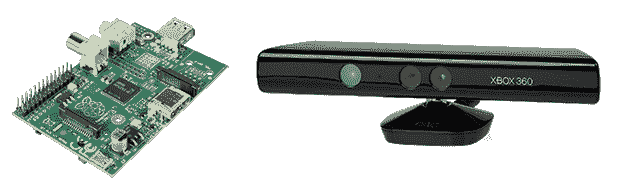

# 建造 Raspi Kinect 3D 扫描仪的竞赛已经开始

> 原文：<https://hackaday.com/2014/06/03/the-race-is-on-to-build-a-raspi-kinect-3d-scanner/>

旧的第一代 Kinect 已经在现实世界场景的 3D 扫描领域得到了相当多的使用。现在 Xbox 360 Kinects 在庭院销售和你当地的善意中结束了，你甚至可能有机会拿一个作为零钱。然而，直到现在，3D 扫描物体只在工作室或车间环境中实用；对于一个移动的便携式扫描仪来说，你需要带着一台电脑和一个电源，这不是你能装进背包里的东西。

现在，终于，这种情况可能会改变。[xxorde] [现在可以通过树莓 Pi](https://github.com/xxorde/librekinect) 从 Kinect 传感器获取深度数据。几乎所有其他的臂板也是如此。它是一个小而快的内核驱动程序，只做一件事:将 Kinect 变成一个显示深度数据的网络摄像头。

当然，便携式的 Kinect 3D 扫描仪在 T1 之前就已经完成了，但那是用一个贵得离谱的 Gumstix 板。有了 Raspi 或 BeagleBone Black，这个驱动程序就有了一个非常便宜的 3D 扫描仪的雏形，比当前的商业或 DIY 桌面扫描仪有用得多。