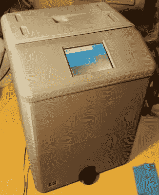

# 增强老年人护理的技术开发竞赛

> 原文：<https://hackaday.com/2015/08/26/the-race-to-develop-technology-that-enhances-elder-care/>

每一代人都会遇到这种情况——我们出生，我们的父母照顾我们，养育我们，我们长大，他们变老，然后我们转换角色，照顾他们。很快就要轮到我照顾我的父母了，最近，当我妈妈摔倒并摔断了脚踝时，我提前预知了将要发生的事情。这不是典型的髋骨骨折，这让我松了一口气，但即使“仅仅”是脚踝骨折也已经够难处理的了。我住的地方离房租处有 40 分钟的路程，虽然这还不算太糟糕，因为探视只是每周一次在格莱美的晚餐，但当探视变成每隔一天一次，以确保妈妈四处走动，爸爸吃饭睡觉时，时间和里程数真的开始增加。

我非常想破解某种解决方案，给自己一个基本的远程呈现，但我想不出任何不会令人无法接受地侵入(想想网络摄像头)或从 IT 角度难以支持的东西。妈妈对 iPad 非常得心应手，她和我哥哥以及他在加州的家人用 Skypes 通话，但除了利用这一点，我还挖掘出一些想法，我可以轻松地部署这些想法，并在治愈脚踝的时间框架内提供足够的价值。因此，今年夏天我在车里呆了很长时间。

这一经历让我开始思考，随着普及技术的兴起，代际照护将会发生怎样的变化。坏消息是:我们还是会变老，而且变老很糟糕。好消息是，我认为技术会让照顾者和老人的事情变得更容易。我们现在的几代人有着令人难以置信的技术体验，从我的父母，他们可以记得没有拨号的电话和听广播的夜晚，到我女儿这一代人，他们几乎是在超级计算机的手掌中长大的。每一代人如何变老，以及他们如何利用科技来解决与年龄相关的问题，都将大不相同。

Smart Desktop Medicine Organizer

### **制作重要的东西**

2015 年 Hackaday 奖的主题是“创造有意义的东西”，令人惊讶和鼓舞的是，许多参赛作品都与老年人护理和就地老龄化问题有关。我最喜欢的参赛作品之一是[智能桌面医疗组织者](http://hackaday.io/project/7019-smart-desktop-medicine-organizer)。这基本上是医院使用的 [Pyxis](http://www.carefusion.com/medical-products/medication-management/) 系统的家庭版本，它是一个云连接的药丸药物分配器，可以跟踪何时分发药丸，警告潜在的药物相互作用，并跟踪合规情况。这对远程护理人员来说是一个福音——能够在你的手机上打开一个应用程序，看看爸爸今天是否吃药了，这将是很方便的。为越来越复杂的药物治疗方案提供组织将对老年人有益。由于它为护理者和老年人都提供了切实的好处，我打赌这将是更容易部署的技术之一。

在侵扰性光谱的更远处，我们看到越来越多的老话“我跌倒了，我起不来了！”设备。另一个 2015 年 Hackaday 奖的参赛作品是[老年资产追踪器](https://hackaday.io/project/6141-elderly-asset-tracker)，一个不可否认不会很好营销的名字。但是，使用加速度计来检测跌倒，并使用手机网络而不是专有无线信号来提醒呼叫列表的可穿戴传感器的想法有很大的潜力。不过，我想我很难让我的父母带着这样的东西——被这样标记和跟踪对你的独立精神来说是很艰难的。也许在智能手机中加入同样的功能会降低接受的门槛。毕竟，任何现代手机上的传感器套件都应该能够检测到摔倒并发出求救信号。有人有年长的亲戚是智能手表的早期用户吗？

Preventice Cardiac Sensor

在我看来，智能手机很可能会成为老年人和护理人员创新的门户平台。我们已经看到[可穿戴心脏传感器](http://www.preventice.com/)通过蓝牙与智能手机对话，并实时监控病人。还有类似于 [FitBit 的设备](http://carepredict.com/)，可以监控和分析活动，并在异常模式开始出现时发出警报，例如睡眠周期的改变或步态速度的变化。这不仅有助于护理人员知道紧急情况何时发生，还可以为一些疾病提供早期预警。对于上了年纪的司机来说， [Automatic 公司价值 99 美元的汽车 OBDII 端口加密狗](https://www.automatic.com/)可以让你跟踪车辆的几乎所有信息，包括司机迷路或困惑时车辆在哪里。

所有这些技术都依赖于护理人员和老年人的采用，也许更重要的是，老年人的采用。这就是代际因素发挥作用的地方。对于我们这些在隐私是一个灵活概念的世界中长大的人来说，很容易被一些网站政策页面上的几段法律术语所规避，我们可能会发现无孔不入的监控更容易吞下。我们知道智能手机给予和索取，当轮到我们开始写最后一章时，我们可能会更渴望采用某种形式的监控。然而，对于我们的父母来说，这可能是一个不同的故事，为了克服他们合理的反对意见而付出的更多努力，加上我们在试图支持我们部署的任何东西时无疑会遇到的困难，可能会使整个事情变得更加麻烦。

### **利用我们的长辈**

黑客社区通常专注于解决眼前的问题。我认为，即将到来的婴儿潮一代老龄化不仅带来了需要解决的短期问题，还带来了利用更大趋势的潜力。仅在美国，预计 2016 年用于老年人护理的支出就将达到 3190 亿美元，预计每年将增长 6%以上。那是一大笔钱，要求哪怕是其中很小的一部分都可以让一个人变得非常富有。

在老年人护理领域，相当数量的 Hackaday 奖参赛作品具有开发成可大规模销售的产品的真正潜力；你可以打赌他们不是唯一走这条路的人。与医疗保健领域的任何事情一样，在下一个大事件进入市场并开始盈利之前，需要通过大量的监管关卡。许多伟大的想法将会半途而废，而成功的黑客将会是那些不仅有伟大的想法，还能在系统中导航并实现其愿景的人。即使是那些没有大获成功的想法，也有足够的空间做出改变，在边缘谋生。如果你能开发出必备的智能手机应用程序，让老年人护理更好、更容易或更便宜，1.99 美元的价格最终可能会非常有利可图，而不会成为那些需要它的人的经济负担。

将我们的技术提升到更好地应对老年人护理的挑战，需要极大的热情和毅力。出于多种原因，将这些想法推向市场并制造有机会改变护理人员和老人生活的产品是一项值得追求的目标。谁知道呢——也许有一天你会以 [的工作结束自己的生命](http://hackaday.com/2015/02/06/developer-saved-years-later-by-his-own-hardware/) 。