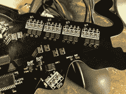
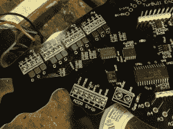

# 红牛创作大赛开始了！

> 原文：<https://hackaday.com/2013/04/09/the-redbull-creation-contest-begins/>

[https://www.youtube.com/embed/D9WPZjcEOdI?version=3&rel=1&showsearch=0&showinfo=1&iv_load_policy=1&fs=1&hl=en-US&autohide=2&wmode=transparent](https://www.youtube.com/embed/D9WPZjcEOdI?version=3&rel=1&showsearch=0&showinfo=1&iv_load_policy=1&fs=1&hl=en-US&autohide=2&wmode=transparent)

红牛创作大赛今天开始。

去年，我们在红牛创作大赛中玩得很开心。这个想法是红牛主办这个大赛，参赛队伍通过制作令人敬畏的东西来竞争。决赛选手将去布鲁克林参加一场盛大的比赛。坦率地说，我们认为所有的广告预算都应该这样花。

然而，今年我们不会以团队的形式参加比赛。我们将帮助评判它！

**硬件:**

前几年，RedBull 已经发出了一些定制硬件供人们使用。去年，它基本上是一个定制 PCB 上的 Arduino，带有一些很酷的触摸传感器。今年，他们已经发出了这种多用途的 LED 控制器盾，看起来相当令人印象深刻。

休息之后，你可以看到所有的细节，以及创作者本人对公告板的分析。

[https://www.youtube.com/embed/JnysbLu3Axo?version=3&rel=1&showsearch=0&showinfo=1&iv_load_policy=1&fs=1&hl=en-US&autohide=2&wmode=transparent](https://www.youtube.com/embed/JnysbLu3Axo?version=3&rel=1&showsearch=0&showinfo=1&iv_load_policy=1&fs=1&hl=en-US&autohide=2&wmode=transparent)

来自[JoeJoe]，该板的创建者:

> Basically, it is kind of an LED lighting multi-tool with some extra sensors and output devices on-board.  The board is controlled over I2C using an Arduino Uno R3, or you can air-wire pretty much any device that supports 400KHz (fast mode) I2C to the breakout pads.  We’ve tested it with some of custom networked devices and with Raspberry Pi, for example.  The I2C addresses of each device are written on the silkscreen of the board, though some peripherals (on PIC microcontrollers for example) expect you to use that address shifted one bit to the left (they don’t automatically add in the low read/write bit).
> 
> 在船上，您会发现以下内容:
> 
> *   驱动 12V RGB LED 灯条的两个智能器件。每个器件将驱动多达四个条带，总共 24 个离散通道。有内置的宏来控制颜色随时间的渐变、脉动、随机颜色扫描等，这些宏减轻了 Arduino 控制这些效果的必要性。要使用这些设备，请遵循印刷电路板上规定的接线，并将 12V 电源连接到电路板顶部的焊盘/端子板。我*假设*这些也可以用于 PWM 任何类型的器件，在电流/功率规格的 MOSFET，但我肯定会建议缓冲二极管，如果你要尝试任何 DC 电机控制。我们在包装中包括了 5M 的 RGB 条。
> *   一个“可寻址 LED 条多工具”设备。它处理基于 WS2811、WS2801 或 LPD8806 IC 的可寻址条带的多达 256 个 RGB 像素的控制时序。我们包括了 1M 的高密度 WS2811 条带，这是该设备的默认模式。使用库宏，你可以写一个帧缓冲区到条，设置两种颜色之间的梯度跨越一些像素，旋转或自动旋转当前帧缓冲区在一个给定的速度，并创建一个效果，如'彗星'追逐。要使用这个设备，你要把 5v 电源接到电路板左下角的标记位置。
> *   一个 DMX 驱动装置。这是在电路板的右下角，用于驱动 3 通道(RGB 模式)DMX 灯具。你可以切开一根 3 针 XLR 电缆，把它连接到 LED 停车罐或任何其他类型的 DMX 固定装置(也许是雾机？).使用这个库，你可以编写一个 DMX 宇宙，它将在正确的时间连续输出到 A 和 B 管脚。
> *   一个 512Kbit 的 EEPROM，里面可能预装了一些有趣的东西。我们包含了非常基本的读/写函数，用于在字节级别上处理这个问题，但是也可以使用更好的 24LC512 库。
> *   一个三轴 MEMS 加速度计。该库具有读取 X、Y 和 z 的功能。该 Kionix 单元还具有许多我们尚未实现的功能，如高通滤波、点击和双重检测、方向变化检测和可调灵敏度(+2g、+4g、+6g)。
> *   一个 12 位 DAC。这将输出 0 至 3.3V 之间的波形，我相信有人会发现这是一个很好的用途。
> *   一个温度传感器。该库具有读取当前温度并将结果转换为摄氏度的基本功能。
> *   一个看起来很棒的电路板，它将和去年的 bullduino 永远和谐地嵌套在一起。

对于那些没有看过视频的人来说，这次活动的灵感来自于:

[https://www.youtube.com/embed/rLDgQg6bq7o?version=3&rel=1&showsearch=0&showinfo=1&iv_load_policy=1&fs=1&hl=en-US&autohide=2&wmode=transparent](https://www.youtube.com/embed/rLDgQg6bq7o?version=3&rel=1&showsearch=0&showinfo=1&iv_load_policy=1&fs=1&hl=en-US&autohide=2&wmode=transparent)